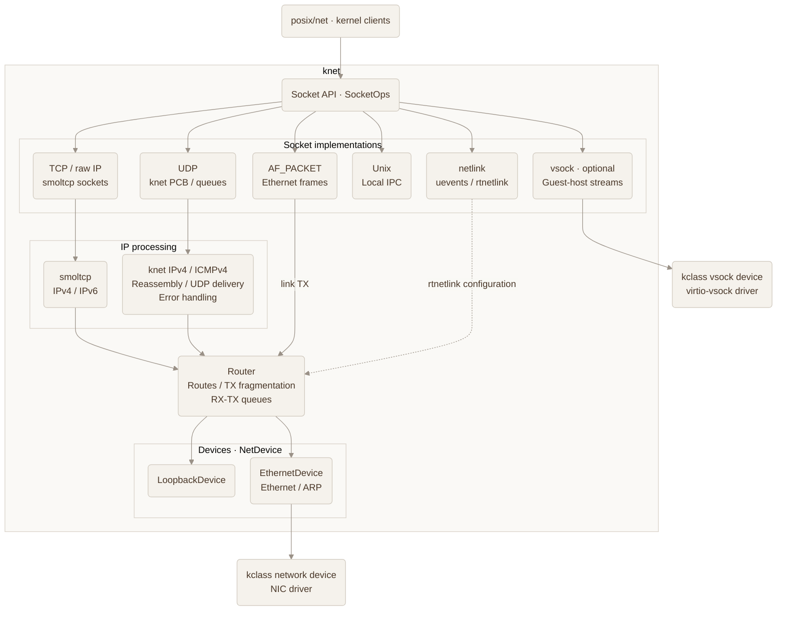
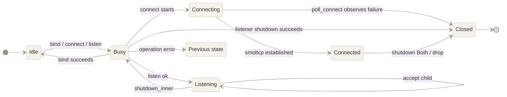
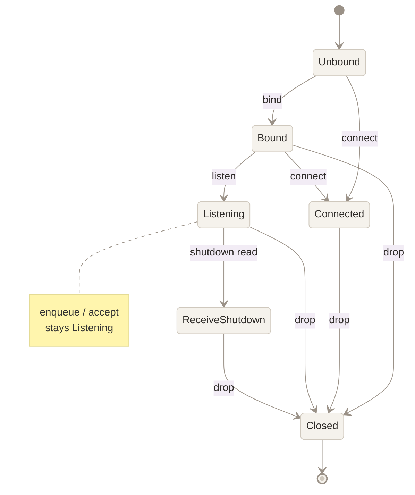
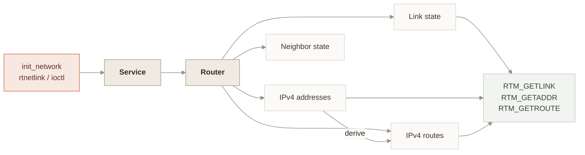
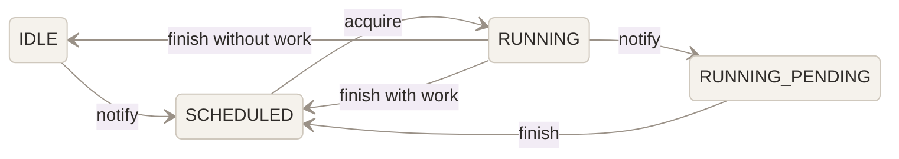

# knet — Design

## Role

`knet` provides a kernel network stack for x-kernel, which combines driver-level network devices, protocol stack, socket objects, poll and wakeup mechanisms, Unix domain sockets, netlink, and optional vsock support into a unified `SocketOps` interface. It is mainly responsible for protocol state, routing, RX/TX progress, and socket semantics. It uses crate-local IPv4, UDP, and ICMPv4 data paths to handle UDP send and receive, fragmentation, and error reporting. smoltcp supplies TCP, raw IP, IPv6, and staged interface polling.

## Background

x-kernel needs socket semantics that can serve both POSIX syscalls and in-kernel clients. `knet` owns protocol state, packet queues, routing, and progress scheduling, while its surrounding subsystems supply device access, task scheduling, filesystem operations, and caller context.

The POSIX network layer in `posix/net` handles syscall arguments, user-memory access, file descriptors, and ABI conversion. `kvfs` owns pathname resolution and access checks, and `anon_inodefs` creates socket files. `kclass` supplies registered network and vsock device handles; concrete drivers own hardware and virtqueue operations. `kirq` supplies the generic softirq mechanism, while `ktask`, `kwork`, and `kpoll` supply timer callbacks, task-context polling, and readiness registration. `knet` determines how these facilities advance network work.

## Scope

The source layout below includes protocol implementations and colocated tests.

```text
net/knet/
├── Cargo.toml
└── src/
    ├── device/
    │   ├── ethernet.rs
    │   ├── loopback.rs
    │   ├── mod.rs
    │   └── net_rx.rs
    ├── link/
    │   ├── buf.rs
    │   ├── mod.rs
    │   ├── packet.rs
    │   └── wire.rs
    ├── netlink/
    │   ├── mod.rs
    │   ├── rtnetlink.rs
    │   ├── socket.rs
    │   ├── tests.rs
    │   └── wire.rs
    ├── socket/
    │   ├── file.rs
    │   ├── general.rs
    │   ├── mod.rs
    │   ├── options.rs
    │   ├── state.rs
    │   ├── test_options.rs
    │   └── test_state.rs
    ├── stack/
    │   ├── fragment.rs
    │   ├── ingress.rs
    │   ├── ipv4.rs
    │   ├── listen_table.rs
    │   ├── mod.rs
    │   ├── router.rs
    │   ├── service.rs
    │   └── wrapper.rs
    ├── transport/
    │   ├── udp/
    │   │   ├── input.rs
    │   │   ├── mod.rs
    │   │   ├── output.rs
    │   │   ├── pcb.rs
    │   │   ├── registry.rs
    │   │   ├── relay.rs
    │   │   ├── socket.rs
    │   │   ├── state.rs
    │   │   └── wait.rs
    │   ├── mod.rs
    │   ├── raw.rs
    │   ├── tcp.rs
    │   └── udp_err.rs
    ├── unix/
    │   ├── stream/
    │   │   ├── channel.rs
    │   │   └── listener.rs
    │   ├── dgram.rs
    │   └── stream.rs
    ├── vsock/
    │   ├── bridge.rs
    │   ├── bridge_connection.rs
    │   ├── bridge_port_map.rs
    │   ├── connection_manager.rs
    │   └── stream.rs
    ├── consts.rs
    ├── control.rs
    ├── ip.rs
    ├── lib.rs
    ├── poller.rs
    ├── unix.rs
    └── vsock.rs
```

## Architecture



Solid arrows show the main API and packet-path relationships; the dotted arrow
shows rtnetlink configuration through `control` and the owning components.
`Service` coordinates IP processing and `Router`; `poller` advances RX, protocol
timers, and TX through kwork or socket-assist polling. AF_PACKET receives frame
subscriptions from `EthernetDevice`, while Unix and vsock use their own transports.

| Component | Responsibility |
|---|---|
| posix/net · kernel clients | Call the socket API from POSIX syscalls or kernel code. |
| Socket API · SocketOps | Provides common operations across socket implementations. |
| TCP / raw IP | Implements TCP and raw IP sockets using smoltcp. |
| UDP | Manages UDP PCBs and queues, using knet's IPv4 path for packet I/O. |
| AF_PACKET | Receives Ethernet frame subscriptions and sends frames through Router. |
| Unix | Provides local stream and datagram communication. |
| netlink | Delivers kobject uevents and handles supported rtnetlink queries and configuration changes. |
| vsock | Provides optional guest-host stream communication through virtio-vsock. |
| smoltcp | Provides IPv4/IPv6 processing for the smoltcp socket path. |
| knet IPv4 / ICMPv4 | Validates and reassembles IPv4 packets, delivers UDP input, and handles ICMPv4 errors and responses. |
| Router | Selects routes, fragments outgoing IPv4 packets, and dispatches RX/TX queues across devices. |
| LoopbackDevice | Returns locally transmitted packets to the receive path. |
| EthernetDevice | Adapts kclass network devices to knet's NetDevice interface and handles Ethernet and ARP. |
| kclass network device · NIC driver | Exposes the registered NIC and performs hardware packet I/O. |
| kclass vsock device · virtio-vsock driver | Exposes the registered vsock device and transports guest-host packets. |

## Calling Constraints and Execution Context

`knet` runs in kernel context, but different code paths have different execution-context requirements. Callers must follow the constraints below.

* **Initialization order**

  `init_network` must complete before Internet sockets access `SERVICE`, `SOCKET_SET`, or `LISTEN_TABLE`, or routing and protocol processing begin. Unix sockets use their own transport and binding state; vsock initialization is handled separately by `init_vsock`. It initializes `SERVICE`, `SOCKET_SET`, `LISTEN_TABLE`, and the initial Router state. The dynamic workqueue used by `knet-poller` is started only after these objects are initialized.

* **vsock startup and callbacks**

  `init_vsock` installs the available raw transport and registers availability/removal callbacks. `start_vsock_bridge` must run after all scheduler run queues are initialized because it starts bridge tasks. Device availability and removal callbacks take sleepable locks. `publish_kobject_uevent`, `send_link_frame`, and relay operations also allocate or acquire sleepable locks and belong in task context. The periodic `Service::handle_timer_tick` callback uses atomic deadline checks, waiter notification, and IRQ-safe poller scheduling.

* **Normal protocol processing runs in task context**

  Paths such as `poller::assist_once`, socket `send` / `recv` / `connect` / `accept`, and netlink mutations may acquire `Mutex` or `RwLock` objects and may execute relatively heavy data-plane work. These paths must run in normal task context.

* **IRQ handlers only signal RX work**

  A device interrupt handler should only acknowledge the device interrupt, mark RX work as pending, and schedule the `NetRx` softirq. It must not run full protocol processing or blocking socket operations directly.

* **`NetRx` may deliver loopback UDP, but must not call `poller::assist_once`**

  `NetRx` runs in a non-sleepable context.

  For Ethernet devices, it only consumes pending RX sources, wakes the corresponding device RX `PollSet`, and schedules `knet-poller`. The actual data-plane processing then runs in kwork task context and is bounded by the configured number of poll rounds.

  Loopback UDP uses a more direct path. Before BH is disabled, the transmit path validates the UDP packet and stores the source/destination information and payload range in the existing `PacketBuf` control metadata. The same `NetRx` action then drains only these prepared handles from `pending_udp`, looks up the PCB through the `SpinNoIrq` registry, moves the packet into a receive queue with reserved capacity, and wakes the socket waiter. The hot UDP delivery path therefore performs no heap allocation.

  TCP, ICMP, IPv6, fragmented packets, and UDP packets that do not match a socket remain in `deferred`. They are later drained by the task poller through `poll_rx`.

  Code running in softirq context must not call `poller::assist_once` or acquire sleepable locks owned by `Service` or `SocketSet`.

* **Blocking operations depend on poll and waker semantics**

  Blocking socket operations rely on `PollSet`, wakers, and timeout registration.

  `Pollable::register` may register sources only through the caller-provided `PollContext`. The corresponding `PollRegistrations` must remain alive while the operation is in the `Pending` state. The caller must also recheck readiness after registration. This preserves cancellation cleanup and closes the race between the readiness check and source registration.

  A blocking Unix stream `connect` waits for listener backlog capacity through `event-listener` when the backlog is full. The wait is bounded by `SO_SNDTIMEO` and therefore requires scheduler support and an interruptible task context.

* **Global state is not tied to a fixed current process or thread**

  Shared access to `SERVICE`, `SOCKET_SET`, and Router state is mainly protected by global locks and atomic state. Syscall-specific semantics are still provided by `posix/net`, which supplies the process file-descriptor context and caller credentials.

  Netlink `send` and socket-file `write` take a snapshot of the current caller credentials when the operation begins. Credentials are not cached in the socket itself.

* **Pathname Unix sockets require filesystem and credential context**

  Userspace `bind` and `connect` operations for pathname Unix sockets must run in a task that has a current thread and a valid filesystem context.

  Kernel callers without a current userspace task must use `bind_with_cred` to provide credentials explicitly, and the calling environment must still provide a valid filesystem context.

* **Concurrency is limited by global serialization points**

  Multiple execution paths may enter the crate concurrently. Critical access to `Service`, `SocketSet`, and listener backlog state is serialized by their corresponding locks.


## State Machines

### TCP Socket State

`TcpSocket` stores `socket::state::State` in `StateLock`. `Idle` permits initial setup, `Busy` serializes a transition, `Connecting` waits for the handshake, `Connected` represents an established endpoint, `Listening` owns a listener entry, and `Closed` records local full shutdown or connection failure. smoltcp maintains the separate TCP wire-protocol state; peer closure alone does not update this local enum.



| From | To | Trigger |
|---|---|---|
| `Idle` | `Busy` | `bind`, `connect`, or `listen` acquires `StateLock::lock`. |
| `Busy` | `Idle` | `bind` succeeds and records the local endpoint. |
| `Busy` | `Connecting` | `connect` starts the smoltcp connection. |
| `Busy` | `Listening` | `listen` registers the socket in `ListenTable`. |
| `Connecting` | `Connected` | `poll_connect` observes smoltcp `Established`. |
| `Connecting` | `Closed` | `poll_connect` observes a state other than `SynSent` or `Established`. |
| `Connected` | `Closed` | `shutdown_inner` handles `Shutdown::Both`, including the file-drop path. A directional shutdown only changes its shutdown flag. |
| `Listening` | `Busy` | `shutdown_inner` acquires the listener state lock. |
| `Busy` | `Closed` | Listener shutdown removes its entry and bound endpoint. |
| `Busy` | Previous state | The closure passed to `StateGuard::transit` returns an error. |

Accepted children start in `Connected`; `accept` leaves the listening socket in `Listening`.

### UDP Socket State

`UdpSocketState::lifecycle` is an `RwLock<UdpSocketLifecycle>` initialized to `Init`. Its setters define these local transitions:

| Update | Resulting state |
|---|---|
| `set_local_endpoint(Some(...))` | `Bound`, with a local endpoint recorded. |
| `set_local_endpoint(None)` | `Init`, with the local endpoint cleared. |
| `set_peer_endpoint(Some(...))` | `Connected`, with peer filtering enabled. |
| `set_peer_endpoint(None)` | `Bound` if a local endpoint remains, otherwise `Init`. |
| `shutdown(Shutdown::Both)` | `Closed`; directional shutdown updates its atomic flag without changing the lifecycle. |

These setters assign the result from their arguments and current endpoint fields. The lifecycle records socket setup and readiness, independently of the PCB's registry membership.

### Unix Stream Listener Lifecycle

The following diagram uses descriptive lifecycle labels, not Rust enum variants. `ListenerState` stores `is_listening`, `is_receive_shutdown`, pending requests, and capacity reservations; the socket binding and optional channel distinguish unbound, bound, and connected endpoints. `listen` enables reception, read shutdown rejects new requests while retaining queued ones, and `close` clears listening state and drains the queue.



### vsock Connection State

With `vsock` enabled, `connection_manager::ConnectionState` records protocol state under each connection's mutex. `Idle` is a bound endpoint, `Listening` owns a listen queue, `Connecting` awaits the peer response, `Connected` permits data transfer, and `Closed` records shutdown or disconnection.

| Origin | Result | Local trigger |
|---|---|---|
| New bound endpoint | `Idle` | `VsockStreamTransport::bind` creates the manager entry. |
| Bound `Idle` endpoint | `Listening` | `listen` registers a listen queue and updates the connection. |
| New outbound connection | `Connecting` | Stream `connect` or `connection_manager::create_bridge_connection` creates an outbound entry. |
| Incoming connection request | `Connected` | The manager accepts a request on a listening or bridge port and creates a child entry. |
| `Connecting` | `Connected` | A `VsockTransportEventKind::Connected` event updates the connection and wakes waiters. |
| Existing connection | `Closed` | Peer disconnection, raw-transport detachment, or stream shutdown closes the entry and wakes affected waiters. |

`VsockStreamTransport` also uses the shared `StateLock` for API admission. Bind performs `Idle -> Busy -> Idle`, listen performs `Idle -> Busy -> Listening`, and connect performs `Idle -> Busy -> Connecting`; a failed guarded operation restores the previous state. Accepted transports start in `Connected`. Subsequent handshake completion and shutdown update the manager's `ConnectionState`; I/O and readiness read that state separately from the transport's admission lock.

With `vsock_tipc_bridge`, `BridgeConnectionState` tracks the TIPC side in `bridge_connection.rs`:

| Origin | Result | Local trigger |
|---|---|---|
| New host-originated entry | `VsockOnly` | `BridgeConnection::new` creates an entry before TIPC attachment. |
| New TIPC-originated entry | `TipcOnly` | `new_tipc_only` attaches the accepted TIPC channel while outbound vsock is pending. |
| `VsockOnly` | `TipcConnecting` | `connect_tipc` attaches the channel returned by `ipc_port_connect_async`. |
| `TipcConnecting` | `Active` | `on_tipc_ready` receives TIPC readiness. |
| `TipcOnly` | `Active` | `on_connected` receives outbound vsock completion. |
| `Active` or `TipcSendBlocked` | `TipcSendBlocked` | `tipc_try_send` receives `WouldBlock` while sending the staged record. |
| `Active` or `TipcSendBlocked` | `Active` | `tipc_try_send` finds no pending bytes or sends the complete staged record. |

`VsockOnly` waits for the dynamic service name on port 0; `TipcSendBlocked` retains one record for retry. `Invalid`, `TipcClosed`, and `Closed` are declared but unused variants. Cleanup removes the entry and closes its channel rather than transitioning through those variants.

### Rtnetlink Control Plane

The rtnetlink control plane provides the interface for querying and modifying network configuration through netlink messages. It handles operations on links, IPv4 addresses, routes, and neighbor state, reads live snapshots from the corresponding network owners, and forwards configuration changes to `Service`, `Router`, or `NetDevice` as appropriate.



| From | To | Trigger |
|---|---|---|
| Device link configuration | Updated device link configuration | `RTM_NEWLINK` updates the target `NetDevice` through `Service::update_device_link`. |
| Device link configuration | `RTM_NEWLINK` response | An `RTM_GETLINK` dump reads all `LinkSnapshot` values; a single-object query reads the matching snapshot by interface index or name. |
| Initial IPv4 address entry | `Router::ipv4_addrs` | `init_network` registers the address through `Router::add_ipv4_addr`; Router also creates the corresponding local and connected routes. |
| IPv4 address entry | smoltcp, `IngressProcessor`, and device address projections | `Service` refreshes all derived views when an address is added, removed, or its owning device is removed. |
| Last owner of an IPv4 address | Router configured routes | When the address is removed, configured routes using that address as `prefsrc` are also removed. |
| Removed device | Router routes and device neighbor state | `unregister_netdev` holds `network_config_lock`; Router removes routes and neighbors associated with the interface and renumbers subsequent interface indices. |
| `RTM_GETADDR` | Router address snapshot | rtnetlink reads `Service::ipv4_addr_snapshots` directly and returns only the specified device's addresses when the request includes an interface index. |
| Initial route | `Router` | `init_network` calls `Router::add_rule` directly. |
| `RTM_NEWROUTE` / `RTM_DELROUTE` / `SIOCADDRT` / `SIOCDELRT` | `Router` | The control plane validates and applies route changes within the Router owner. |
| `RTM_NEWNEIGH` | Target `NetDevice` | rtnetlink forwards the update through `Service` and `Router` to the device neighbor table. |

### Network Data-Plane Poller



| Current State | Operation | Next State | Wake-up Behavior |
|---|---|---|---|
| `IDLE` | `notify` | `SCHEDULED` | Queues `knet-poller` work. |
| `SCHEDULED` | `notify` | `SCHEDULED` | The existing wake-up remains valid. |
| `SCHEDULED` | A kwork callback or assist acquires execution ownership | `RUNNING` | The current executor runs one round or a bounded batch of rounds. |
| `RUNNING` | `notify` | `RUNNING_PENDING` | The current executor is responsible for scheduling follow-up work when it finishes. |
| `RUNNING_PENDING` | `notify` | `RUNNING_PENDING` | The pending state is preserved. |
| `RUNNING` | Finishes with no immediate work remaining | `IDLE` | No wake-up is issued. |
| `RUNNING` | Finishes with immediate work remaining | `SCHEDULED` | Queues `knet-poller` work for the next round. |
| `RUNNING_PENDING` | Finishes | `SCHEDULED` | Queues `knet-poller` work for the next round. |

`SCHEDULED` means that pending work has been published for further processing. `RUNNING` means that a single executor currently owns the right to run the poller, while `RUNNING_PENDING` records new notifications that arrive during execution. On completion, a single CAS returns execution ownership and publishes either `IDLE` or `SCHEDULED`. When `notify` races with completion, the event is preserved through the same atomic state-transition sequence.

In the `SCHEDULED` state, the dynamic kwork of `knet-poller` and socket assist compete for execution ownership of the next batch. Loopback UDP does not depend on poller ownership; its transmit path completes xmit and `NetRx` delivery within the BH-disabled window.

`Interface::poll_at` and TCP deferred close share the protocol timer source, while the IPv4 reassembly queue uses a separate timer source. When a timer expires, it schedules the poller and wakes tasks waiting for socket readiness.

## Algorithms

### Network Initialization

`init_network` always creates loopback with `127.0.0.1/8`. It also attaches one registered NIC when available, using the configured IPv4 address and default gateway. Router address entries generate local and connected routes; `Service::new` synchronizes the IPv4 views used by smoltcp and ingress.

**Algorithm 1. Network Initialization**

**Input:** Registered NIC handles and IPv4 configuration.

**Output:** Initialized network service, sockets, and poller.

| Line | Operation |
|---:|:---|
| 1 | **Procedure** `init_network()` |
| 2 | &emsp;`nics = kclass.net_devices()` |
| 3 | &emsp;`router = Router.new()` |
| 4 | &emsp;`lo = router.add_device(LoopbackDevice.new())` |
| 5 | &emsp;`router.add_ipv4_addr(lo, 127.0.0.1/8, host_scope)` |
| 6 | &emsp;**if** `nics.pop()` yields `nic`: |
| 7 | &emsp;&emsp;`eth = router.add_device(EthernetDevice.new("eth0", nic))` |
| 8 | &emsp;&emsp;`router.add_ipv4_addr(eth, configured_ipv4, universe_scope)` |
| 9 | &emsp;&emsp;`router.add_default_route(eth, configured_gateway)` |
| 10 | &emsp;&emsp;`subscribe_network_unregister(nic.id)` |
| 11 | &emsp;`SERVICE.init_once(Service.new(router))` |
| 12 | &emsp;`SOCKET_SET.init_once(SocketSetWrapper.new())` |
| 13 | &emsp;`LISTEN_TABLE.init_once(ListenTable.new())` |
| 14 | &emsp;`init_udp_registry()` |
| 15 | &emsp;`network_poller.start()` |
| 16 | &emsp;`register_timer_callback(TIMER_SAMPLE_PERIOD, SERVICE.handle_timer_tick)` |

Source: [`init_network`](../src/lib.rs) and [`Service::new`](../src/stack/service.rs). The pseudocode abbreviates address and route construction.

### RX Progress

Ethernet RX notifications use `NetRx` to wake RX poll sources and schedule `knet-poller`. Prepared loopback UDP packets have a separate softirq delivery path; deferred loopback packets enter task-context polling. Socket assist executes one already-scheduled round. Background work and assist acquire the same execution right through `SCHEDULED -> RUNNING`; notifications received during execution are retained as `RUNNING_PENDING`.

Each `Service::poll_budgeted` round first attempts pending IPv4 reassembly expiration and flushes retained ingress/control batches. It then dispatches queued TX, drains device RX, advances smoltcp, and uses the remaining TX and device-RX budgets for a second pass. Device RX and smoltcp ingress each have a separate allowance of `budget.rx_packets`.

Device draining rotates its starting position across devices, consuming each device until it is empty or the batch budget is exhausted. IPv4 validation, destination filtering, reassembly, and UDP delivery run after releasing Router. Unmatched unicast UDP can generate ICMP port-unreachable responses; unsupported unicast IPv4 protocols can generate protocol-unreachable responses. ICMP errors are inspected for UDP before eligible packets enter the smoltcp batch. IPv6 enters that batch directly.

The following pseudocode summarizes the round. Failed shared-state `try_lock` acquisitions retain pending batches and return `has_more = true`. Contention during reassembly expiration only defers that timer work, allowing the round to continue. Reusable batch mutexes and nested listener operations still use blocking locks.

**Algorithm 2. RX Progress**

**Input:** RX budget $B_{\mathrm{rx}}$, TX budget $B_{\mathrm{tx}}$, timer budget $B_{\mathrm{timer}}$, and retained packet batches.

**Output:** Progress counters and the immediate-work flag `has_more`.

| Line | Operation |
|---:|:---|
| 1 | **Procedure** `poll_budgeted(budget)` |
| 2 | &emsp;start = monotonic_time() |
| 3 | &emsp;lock reusable RX, accepted, and control batches |
| 4 | &emsp;try to expire pending IPv4 fragments within $B_{\mathrm{timer}}$ |
| 5 | &emsp;flush retained batches, or return retry |
| 6 | &emsp;tx_done = dispatch queued TX within $B_{\mathrm{tx}}$ |
| 7 | &emsp;drain_device_rx($B_{\mathrm{rx}}$ unless time limit reached) |
| 8 | &emsp;`try_lock` socket set, then Router, then Interface; otherwise return retry |
| 9 | &emsp;`Interface.poll_maintenance()` |
| 10 | &emsp;**if** time limit has not been reached: |
| 11 | &emsp;&emsp;poll smoltcp ingress within $B_{\mathrm{rx}}$ |
| 12 | &emsp;call `Interface.poll_egress()` at least once |
| 13 | &emsp;**repeat** while progress continues, within $\max(B_{\mathrm{tx}}, 1)$ passes and the soft time limit |
| 14 | &emsp;reap deferred TCP closes and read `Interface.poll_at()` |
| 15 | &emsp;release Interface; refresh TCP acceptors; release socket set |
| 16 | &emsp;dispatch queued TX within remaining TX budget if time remains |
| 17 | &emsp;release Router |
| 18 | &emsp;**if** time and device-RX budget remain: |
| 19 | &emsp;&emsp;drain_device_rx(remaining device-RX budget) |
| 20 | &emsp;publish the earliest protocol / deferred-close deadline |
| 21 | &emsp;`try_lock` Router, or return retry |
| 22 | &emsp;**return** progress with `has_more` for pending RX, ingress, TX, immediately due protocol work, or pending reassembly expiration |
| 23 | **Procedure** `drain_device_rx(remaining)` |
| 24 | &emsp;process retained RX batch and flush accepted/control batches |
| 25 | &emsp;**while** budget and time remain: |
| 26 | &emsp;&emsp;`try_lock` Router, or return retry |
| 27 | &emsp;&emsp;pull a bounded batch, limited by smoltcp ingress capacity |
| 28 | &emsp;&emsp;release Router |
| 29 | &emsp;&emsp;`try_lock` IngressProcessor, or retain batch and return retry |
| 30 | &emsp;&emsp;validate/filter IPv4, reassemble fragments, deliver UDP, collect ICMP responses and packets accepted for smoltcp |
| 31 | &emsp;&emsp;release IngressProcessor |
| 32 | &emsp;&emsp;flush accepted/control batches, or return retry |
| 33 | &emsp;&emsp;**stop** when device draining reports no more work |
| 34 | **Procedure** `flush accepted/control batches` |
| 35 | &emsp;`try_lock` socket set if accepted batch is nonempty |
| 36 | &emsp;`try_lock` Router; on failure retain both batches and return retry |
| 37 | &emsp;prepare TCP listeners and enqueue accepted packets |
| 38 | &emsp;enqueue control packets; drop a control packet if its TX queue is full |
| 39 | &emsp;release acquired locks |

The 1 ms limit is a soft bound checked between work batches. Maintenance and one egress call still run after bulk RX/TX reaches this limit, provided the required locks are acquired. Packets waiting in retained batches and FIFO queues remain for later rounds. The tail RX pass queues accepted smoltcp packets for a later round.

A background callback runs at most four rounds, each with fresh budgets; assist runs at most one. Completion reschedules immediate work or notifications received during execution. The periodic timer callback checks protocol and reassembly deadlines, wakes waiters, and publishes timer work. Future deadlines alone do not set `has_more`.

Sources: [`poller`](../src/poller.rs), [`Service`](../src/stack/service.rs), [`IngressProcessor`](../src/stack/ingress.rs), and [`Router`](../src/stack/router.rs).

### TX Routing

UDP builds IPv4 packets in knet; TCP and raw sockets submit packets through smoltcp. UDP sends routed to loopback bypass the poller TX queue. Other UDP sends enter the data queue after fragmentation and capacity checks. smoltcp output enters the data queue, including loopback traffic, while generated ICMPv4 errors use the control queue. AF_PACKET sends link frames through Router directly to the selected device.

**Algorithm 3. TX Routing**

**Input:** UDP payload, destination, source/interface binding, and TX budget $B_{\mathrm{tx}}$.

**Output:** Transmitted or queued packets, errors, and dispatch progress.

| Line | Operation |
|---:|:---|
| 1 | **Procedure** `send_udp(payload, destination, bound_source, bound_interface)` |
| 2 | &emsp;lock Router |
| 3 | &emsp;check broadcast permission and select an active output route |
| 4 | &emsp;source = bound_source if set, otherwise route-selected source |
| 5 | &emsp;**if** output device is not loopback: |
| 6 | &emsp;&emsp;check data-queue capacity for the expected packet count |
| 7 | &emsp;build UDP checksum and IPv4 header |
| 8 | &emsp;choose DF from `IP_MTU_DISCOVER` and route MTU |
| 9 | &emsp;fragment oversized IPv4 output; return `EMSGSIZE` if DF forbids it |
| 10 | &emsp;**if** output device is loopback: |
| 11 | &emsp;&emsp;dispatch fragments immediately |
| 12 | &emsp;**else**: |
| 13 | &emsp;&emsp;enqueue all fragments with the bound interface, or return `WouldBlock` |
| 14 | &emsp;release Router |
| 15 | &emsp;notify(Tx); assist_once() |
| 16 | **Procedure** `dispatch_budgeted(tx_budget)` |
| 17 | &emsp;**repeat** up to $B_{\mathrm{tx}}$ times: |
| 18 | &emsp;&emsp;packet = pop control queue first, otherwise data queue |
| 19 | &emsp;&emsp;**stop** if both queues are empty |
| 20 | &emsp;&emsp;**if** IPv4: |
| 21 | &emsp;&emsp;&emsp;prepare IPv4 length/checksum fields |
| 22 | &emsp;&emsp;&emsp;**if** limited broadcast: |
| 23 | &emsp;&emsp;&emsp;&emsp;validate source and replicate to interfaces allowed by binding |
| 24 | &emsp;&emsp;&emsp;**else**: |
| 25 | &emsp;&emsp;&emsp;&emsp;look up longest-prefix route |
| 26 | &emsp;&emsp;&emsp;&emsp;validate bound interface and local source |
| 27 | &emsp;&emsp;&emsp;&emsp;send through route device to gateway or destination |
| 28 | &emsp;&emsp;**else if** IPv6 multicast: |
| 29 | &emsp;&emsp;&emsp;replicate to all devices |
| 30 | &emsp;&emsp;**else if** IPv6 unicast: |
| 31 | &emsp;&emsp;&emsp;look up route, verify source, and send through route device |
| 32 | &emsp;**return** processed count and whether TX or resulting RX work remains |

IPv4 limited broadcast is replicated subject to interface binding. Other IPv4 destinations, including multicast and directed broadcast, use route lookup. IPv6 multicast is replicated to all devices in this dispatch path. These rules differ from a general multicast fan-out policy.

`EthernetDevice` currently accepts IPv4 output only. It checks link state, source, and MTU, then sends limited and directed broadcasts to the Ethernet broadcast address. Other next hops use the ARP cache: a valid entry permits immediate transmission; an unresolved or expired entry triggers an ARP request when needed and retains the packet in bounded `pending_tx`. A full pending queue drops the packet. IPv6 remains available in the smoltcp and loopback paths, while the Ethernet adapter drops IPv6 output.

Sources: [`UDP send`](../src/transport/udp/socket.rs), [`Service::prepare_and_send_ipv4_packet`](../src/stack/service.rs), [`Router`](../src/stack/router.rs), and [`EthernetDevice::send_ip_packet`](../src/device/ethernet.rs).

## Concurrency Model

Concurrency is organized around a single owner for protocol progress, with finer-grained locks protecting socket, queue, and control-plane state.

### Protocol Progress

The global `SERVICE` is a `LazyInit<Service>`. Separate mutexes protect the smoltcp `Interface`, the `Router`, the `IngressProcessor`, and each reusable RX, accepted-packet, and control-packet batch. The poller acquires the first three with `try_lock`. If any of these locks is contended, the poller retains the batch and reports that work remains immediately available. These batches are accessed only by the executor that owns the global protocol-progress right.

`NetworkPoller` represents this execution right with the four states maintained by `kwork::BudgetedPoller`: `IDLE`, `SCHEDULED`, `RUNNING`, and `RUNNING_PENDING`. A kwork background batch may process 512 RX packets, 256 TX packets, and 32 timer events. A socket-assisted batch uses smaller budgets of 16, 16, and 8. Every round also has a 1-ms soft time limit. Background batches run at most four consecutive rounds, while one assistance call runs at most one round. When a background batch reaches its round limit, it queues another batch and releases the execution right.

Protocol and IPv4 reassembly deadlines use separate `AtomicU64` fields. The periodic sampling callback is deliberately small: it checks the atomic deadline, wakes waiters, and notifies the poller. Each successful staged smoltcp poll refreshes the protocol timer through `Interface::poll_at`, so TCP retransmission and similar deadlines continue to advance even when socket waiters are blocked.

The global `SOCKET_SET` wraps `SocketSetState` in a single mutex. The smoltcp socket set and TCP deferred-close metadata share this ownership lock, so socket registration, protocol progress, close, and reclamation never transfer a handle between two mutexes. TCP transition admission uses atomic compare-and-swap through `StateLock::lock`, returning the observed state if admission fails; `StateGuard::transit` publishes the result or restores the previous state with an atomic store. Socket options and shutdown flags use atomics only for configuration and shutdown state shared across threads.

### Receive Path and UDP Queues

The Router lock covers RX device pulls and TX dispatch. IPv4 validation, filtering, and UDP demultiplexing run after both the Router lock and the smoltcp socket-set lock have been released. TCP snooping runs once the accepted batch holds both locks, keeping listener side effects within the same batch handoff. The smoltcp ingress queue has fixed capacity, and each call to `poll_ingress_single` consumes one packet. Packets left behind because a budget or time limit was reached, or because a shared lock was contended, remain available for a later round.

`UDP_PCB_REGISTRY` contains 256 port-based buckets. Each bucket uses `SpinNoIrq` because `NetRx` performs PCB lookups in softirq context. The receive queue and connected peer of each PCB use the same lock type. Sleepable bind and connect state updates remain outside the bucket lock.

Before a packet enters a PCB queue, the loopback send path validates the datagram before entering BH context, or the ordinary ingress path validates it in task context. Address and payload-range parsing occurs at the same stage, and the results are stored in the packet's control metadata. The receive queue then stores only a pointer-sized `PreparedUdpPacket`, which retains the `PacketBuf` handle created when the packet entered the stack.

Each PCB reserves 1,024 `VecDeque` slots at creation. This follows the Linux `__udp_enqueue_schedule_skb` pattern, where `__skb_queue_tail` inserts an existing `skb` while holding `sk_receive_queue.lock`. Accordingly, `enqueue` performs only an occupancy check and inserts an existing handle while running in softirq context under `SpinNoIrq`. If the queue is full, it releases the queue lock before reclaiming the packet. `MSG_PEEK` increments the `PacketBuf` reference count under the lock and copies the payload after releasing it.

The shared `NET_RX_QUEUE` is also protected by `SpinNoIrq` and is used by loopback transmit, `NetRx`, and task-context `poll_rx`. Its `pending_udp` and `deferred` queues both contain pointer-sized `PacketBuf` values. `NetRx` removes already-annotated entries from `pending_udp` under its budget for UDP delivery; the task poller removes other packets from `deferred`. Capacity accounting includes both queue lengths and all in-flight packets, so producers cannot consume slots that are temporarily vacant while a packet is being delivered to a PCB. If a UDP packet matches no PCB, this path retains unique ownership, clears the packet metadata, and moves it to `deferred`.

`IngressProcessor::ipv4_reassembler` owns reassembly queues and is protected by `Service::ingress`, a `Mutex<IngressProcessor>`. The global `SERVICE` is a `LazyInit<Service>` with separate component locks.

The UDP socket lifecycle and local endpoint use separate `RwLock`s, while the peer endpoint uses `SpinNoIrq` for softirq lookup. The asynchronous-error queue has its own mutex; error status, shutdown flags, and receive-error enablement use atomics. Socket-local waiter sets report data, errors, write readiness, and shutdown independently of device RX notifications.

### TCP and Unix Stream Synchronization

`LISTEN_TABLE` stores listeners in a `Mutex<HashMap<...>>`, and each listener entry uses its own mutex for the backlog queue. The entry's `accept_poll` sits outside that mutex. `register_accept_waker` first registers with `accept_poll` without taking the entry lock, then briefly locks the entry to recheck readiness. This preserves the register-and-recheck sequence without running `Waker::clone` or other `PollSet` operations under the queue lock.

The poller revisits an entry after a new packet arrives or whenever its SYN queue is nonempty. A child that becomes acceptable during a later ingress or timer poll can then move from the SYN queue to the accept queue. `accept_poll` wakes its waiters only after the entry lock has been released.

TCP's `bound_endpoint` mutex protects one socket's local binding. `TCP_BOUND_ENDPOINTS` uses a mutex to serialize port-conflict accounting, and the ephemeral-port cursor is separately mutex-protected. Raw socket local and peer addresses and TTL use `RwLock`s; their smoltcp buffers remain under `SOCKET_SET`.

`ABSTRACT_BINDINGS` and `PATH_BINDINGS` use separate mutexes for Unix address lookup. Each `BindEntry` contains independently locked stream and datagram binding slots. `UnixDomainSocket` protects its local and peer addresses with mutexes. Datagram transports protect the receiver and binding slot with mutexes and the connected peer and local address with `RwLock`s; `async_channel` and poll sets handle queued delivery and notifications.

Unix stream synchronization is divided by responsibility:

- Each endpoint stores its channel in `channel: Mutex<Option<Channel>>`. This mutex serializes the final commit of `connect`, along with `send`, `recv`, `shutdown`, and channel release on the same endpoint.
- Each listener keeps its FIFO pending queue, reserved-capacity count, backlog limit, listening state, and read-shutdown state in `ListenerState` under a separate mutex. `request_available` wakes `accept`, while `capacity_available` wakes blocked `connect` calls. The binding-slot lock is held only long enough to clone the listener reference and is released before any capacity wait. The fixed lock order is `channel`, listener handle, and `ListenerState`.
- Each endpoint uses `tx_order: SpinNoPreempt<()>` as the ordering point for one transmit direction. Local write shutdown, peer read shutdown, write-index publication, and peer-side EOF detection on an empty queue all pass through this lock. Code acquires the `channel` mutex before a single `tx_order`, and never holds the ordering locks for both directions at once.

`send` first writes into an unpublished vacant region, then takes `tx_order` to recheck shutdown state and publish the new write index. If `recv` observes an empty queue, it rechecks the occupied length and shutdown state under the same ordering lock. `shutdown` publishes the completed state and clones the peer endpoint reference while holding the `channel` mutex, then releases the mutex before waking waiters. Listener-event notifications likewise occur outside both `ListenerState` and the source socket's `channel` lock, while user-data copies and `PollSet` wakeups occur outside `tx_order`.

Readable, writable, and connection-state events use separate `PollSet` instances for each endpoint. A write wakes the peer's readable waiters. A read wakes the peer's writable waiters when buffer occupancy crosses the send-buffer low-water mark. A half-close wakes the affected direction, and a full close notifies both endpoints through their connection-state waiters.

### Packet and vsock Synchronization

`PACKET_HANDLERS` protects weak socket registrations with a mutex and tracks the active count atomically. Each packet socket uses an `RwLock` for its binding, a mutex for its bounded RX queue, and a separate `recv_lock` to serialize receive/peek operations across payload copying. Packet and drop statistics use atomic counters. Frame publication snapshots active sockets before accessing their queues.

`VSOCK_DEV` protects the installed class-device handle, and `VSOCK_CONN_MANAGER` protects transport ownership, connection/listener maps, bridge ports, and queued events. Each `Connection` and `ListenQueue` has a separate mutex. Stream transports protect their connection references with mutexes and serialize sends with `tx_lock`; the manager never acquires that send lock. Paths that need nested device, manager, and connection access follow `VSOCK_DEV -> VSOCK_CONN_MANAGER -> Connection`. Sends snapshot transport and credit state and release manager/connection guards before driver I/O or credit waits.

`POLLER_STATE` protects the vsock polling reference count and running flag; the idle backoff uses an atomic counter. The bridge has separate mutexes for connections, deferred RX events, and published ports. Atomic flags coordinate startup, and an atomic token counter identifies TIPC handle-set entries. TIPC handle sets, poll sets, and wait queues notify bridge workers and socket waiters.

### Control Plane and RX Wakeups

The Router owns configured routes, address-derived routes, and dynamic source-selection state. Each device owns its neighbor table. Netlink handles protocol parsing and live-snapshot encoding, then calls the appropriate owner.

`control::network_config_lock` serializes control-plane mutations across sockets, legacy socket-ioctl mutations, and `unregister_netdev`. Each netlink socket has mutexes for its send transaction and RX queue and an `RwLock` for its local address. The global `UEVENT_SUBSCRIBERS` mutex protects weak subscriber references, and `UEVENT_SEQNUM` atomically allocates event sequence numbers. The send-transaction lock covers capacity preflight, mutation execution, and response enqueueing for one socket. Responses are generated outside the RX-queue lock; that lock is taken only to check capacity and enqueue the result. The fixed acquisition order is the send-transaction lock, `network_config_lock`, Router, ingress, Interface, and netlink RX queue, omitting any lock that the operation does not use.

`GeneralOptions` stores device binding in `bound_dev_if: AtomicI32`. UDP lookup and transmission and TCP/raw RX-device selection read this field with Relaxed ordering. Binding and unbinding use an atomic exchange; an actual change notifies `device_binding_changed: PollEvent`, whose Release/Acquire version ordering publishes the preceding field update. Repeated writes of the same interface index remain silent.

RX registration reads the event version, reads the interface index, registers device sources and the binding-change event, then rechecks the version. Changes during registration trigger a readiness recheck; changes while waiting trigger registration renewal. Each new `PollRegistrations` replaces the old device registrations, and cancellation or completion removes the binding-change subscription.

TCP and raw IP use `GeneralOptions::rx_device_mask` to select RX devices. Explicit `SO_BINDTODEVICE` selects the specified device; default and unbound states select all devices. Address binding, connection state, and route changes are independent of this selection, while the protocol receive path filters packet delivery.

`Service::register_rx_waker` uses the caller's `PollContext` to register the aggregate `timeout_poll` and any Ethernet RX poll source that supports interrupt-driven RX. When a device becomes pending, the `NetRx` softirq wakes the corresponding poll source and schedules `knet-poller` work for background protocol progress. TCP and raw IP waiters can also wake through that source. `PollRegistrations` keeps these registrations alive across the `Pending` state.

Loopback devices and Ethernet devices without an attached `NetRxScheduler` continue to use the aggregate `timeout_poll` waker, which supports broadcast wakeups to multiple tasks. The device layer does not retain raw caller wakers or register a separate, inequivalent task waker outside `Service`.

UDP receive-only waits subscribe to socket events in `UdpSocketWaiters`. Receive enqueueing, asynchronous errors, and read shutdown wake the corresponding waiters. UDP lookup applies address and device-binding filters, so existing receive subscriptions remain valid across binding changes. Ethernet RX softirq independently schedules `knet-poller`; prepared loopback UDP is enqueued by `NetRx` or the send path's task-context fallback. Sender TX notifications advance other loopback work, and protocol and reassembly deadlines independently notify the background poller. Receive-only waits therefore remain independent of device RX broadcasts and aggregate `timeout_poll` notifications. Send waits continue to subscribe to network-progress events, and combined read/write waits retain the device and timer subscriptions needed for TX. `PollRegistrations` owns all socket-event registrations, followed by a readiness recheck.

Ethernet RX source registration is protected by `NET_RX_SOURCES: SpinNoIrq<NetRxSources>`. Each source publishes pending work through an atomic flag, and the IRQ-safe scheduler keeps only a weak source reference. Device teardown detaches the scheduler and unregisters the source. Source identifiers and softirq availability also use atomics.

## Design Decisions

### UDP and IPv4 Data Paths

Crate-local types own UDP PCBs, bind-conflict checks, send and receive queues, IPv4 validation, fragment reassembly, output fragmentation, and ICMPv4 errors. TCP, raw IP, and IPv6 use the smoltcp socket set, driven by `knet-poller` and explicit `poller::assist_once` calls. This boundary keeps UDP independent of smoltcp socket handles while preserving TCP and raw-socket semantics.

### Budgeted Processing

The `NetRx` softirq, socket TX paths, protocol timers, and socket assist share one `NetworkPoller`. Its four-state atomic state machine publishes pending work and grants execution to a single owner through a `SCHEDULED -> RUNNING` CAS. Notifications received during execution set `RUNNING_PENDING`, causing completion to schedule another batch. Assist only consumes scheduled work; it neither creates events nor waits for ownership.

Loopback UDP is delivered directly to the PCB within the transmit path's bottom-half window, following the Linux sequence from `dev_queue_xmit` through `loopback_xmit` and `__netif_rx` to softirq processing at `local_bh_enable`. TCP, ICMP, and IPv6 use the poller's TX-then-RX rounds.

RX, TX, and timers have separate budgets, and each `Service` round has a 1 ms soft time limit. Staged smoltcp APIs bound ingress and egress work. TX stages share one budget, as do the main and final RX stages, allowing loopback TCP and ICMP to complete a device round trip within one assist. Control traffic takes priority over data traffic. Router, Interface, or socket-set contention ends the round with `has_more` set. IPv4 reassembly processing acquires the `IngressProcessor` lock only for pending expiry events; contention preserves those events while TX continues. Expiry events are processed under the timer budget across successive rounds.

TCP sends fill the smoltcp buffer and notify the poller, which advances the protocol and dispatches TX in bounded batches. TCP receives publish `RxWindow` when free buffer space before the read is below the maximum window-scaling quantum; subsequent window growth uses RX and timer processing. TCP and raw sockets register aggregate send wakers with smoltcp, while `PollProgress::tx_capacity_changed` wakes poller TX waiters when Router data-queue slots become available. Separate atomic deadline sources track protocol and deferred-close timers and IPv4 reassembly. Periodic sampling wakes socket waiters and notifies the poller when deadlines expire.

### Control-Plane State Ownership

Devices own link configuration and expose interface names, MTUs, administrative and operational states, and hardware addresses through `NetDevice::link_snapshot`. `RTM_GETLINK` and `RTM_NEWLINK` access this device-owned state directly. The AF_PACKET send path obtains an allocation-free `LinkSendSnapshot` under the Router lock, validates it after releasing that lock, and reacquires the Router lock through `Service::send_link_frame` for transmission. Snapshot validation and dispatch are separate critical sections. Device-existence checks use `has_device`, and route MTU queries read the matching device directly. Configuration changes or device removal rebuild the smoltcp `Interface` only when the effective MTU changes, keeping cached `DeviceCapabilities` consistent with the device set while otherwise preserving runtime caches.

`Router` owns `Ipv4AddrEntry` values with `dev`, `addr`, `scope`, and optional `broadcast` fields. The broadcast override is exposed as `ifa_broadcast` in rtnetlink. Broadcast addresses default to the CIDR-derived value. Insertion validates the device, unicast address, and smoltcp address capacity. Legacy address and netmask ioctls update the primary entry while preserving other addresses on the device. Netmask updates retain the scope and recompute the broadcast address only when its previous value was mask-derived.

Each address produces a `/32` local route and a connected route for its network. Address removal clears derived routes, routes whose preferred source becomes invalid, and the device's pending TX. `Service` projects Router addresses into the smoltcp `Interface`, `IngressProcessor`, and devices; Ethernet uses them for ARP, directed broadcasts, and packets awaiting neighbor resolution.

Configured routes belong to `Router`, where `RTM_NEWROUTE` and `SIOCADDRT` require gateways to lie within the output interface's IPv4 subnet and exclude directed-broadcast addresses. Ethernet devices own their neighbor tables, so route and neighbor mutations operate through their respective owners. `unregister_netdev` holds `network_config_lock` while Router removes the device's routes, addresses, and neighbors and renumbers subsequent interface indices.

### Credentials for Unix Pathname Sockets

Linux implicitly reads credentials from the task context through `current_cred()`. Since knet serves both user tasks and kernel callers during boot, it passes credentials explicitly. User-facing entry points take one credential snapshot at the start of an operation and pass `&Cred` through subsequent VFS path lookups. Kernel callers specify credentials through `bind_with_cred`.

Credentials follow the call path, keeping their lifetime separate from Unix sockets, path-lookup state, and dentries. `sock_alloc_file` explicitly receives `Arc<Cred>` and stores it in `VfsFile::cred`; the socket object retains only its own state. Entry points obtain the current task's credentials, and knet uses the supplied credentials throughout the operation.

### Credentials for rtnetlink Sends

Netlink sockets can be passed between processes, so permission checks use the credentials of each sender. POSIX send and socket-file write identify the protocol at entry. The netlink branch takes one current-credential snapshot and passes it through `Socket::send_with_cred` to rtnetlink permission checks. Other protocols continue to use `SocketOps::send`, keeping credential propagation confined to paths that require authorization. Kernel callers outside a user-task context specify credentials explicitly through `send_with_cred`.

### Device Masks for RX Wakeups

TCP and raw IP derive their RX device mask from `SO_BINDTODEVICE`. Explicit binding narrows device subscriptions; default and unbound states select all devices. Waiters register with those devices and the smoltcp poll timeout, then use actual readiness to determine user-visible events. Address binding, connection state, and route changes leave device selection independent. UDP receive-only waits use socket-local events after demultiplexing applies the device-binding filter.

smoltcp's `poll_at` returns a deadline with the same epoch as the supplied timestamp, allowing the compatibility layer to map `SmoltcpInstant` directly to `MonotonicInstant`. This mapping preserves expired deadlines without signed-delay calculations or `as u64` conversions.

### TCP Listener and Connection Management

knet manages listening sockets separately from accepted child connections. `ListenTable` creates a child smoltcp socket when a SYN arrives and places the pending connection in the backlog queue, keeping POSIX accept semantics within knet.

The listener table therefore snoops initial TCP packets, cleans up aborted children, and rechecks connections in the SYN queue whenever the network makes progress. Network events and protocol deadlines drive subsequent polling. Pending connections in the SYN queue do not themselves request continuous polling, avoiding busy loops before a protocol deadline expires.

### Unix Stream Waiters and Send Ordering

A bidirectional Unix stream channel stores a separate `StreamEndpoint` for each end. Each endpoint uses atomics to track local read/write shutdown state and pending connection errors, while `StreamPollSets` maintains separate readable, writable, and connection-state waiter sets. `ListenerQueue` holds listener state and pending connections, notifying the endpoint's readable waiters when a connection request arrives.

Read events register with the readable set, write events with the writable set, and waiters interested only in connection state with the connection-state set. Each waiter uses the corresponding fixed-capacity set, avoiding duplicate registrations for the same direction. Writing data to the ring buffer notifies peer readers. Reading data notifies peer writers when send-buffer occupancy falls from above one-quarter capacity to below that threshold. When both connection directions close or an endpoint is released, all three sets are notified so that waiters can recheck readiness.

Each `StreamEndpoint` uses `tx_order` to coordinate data publication and shutdown in its send direction. Send commits the write index under this lock, shutdown publishes closure under the corresponding direction lock, and peer recv uses the same lock for its final empty-queue and EOF checks. This ordering ensures that the receiver observes published data before EOF. If shutdown acquires the direction lock first, subsequent sends return `BrokenPipe`.

A blocking send that encounters shutdown after making progress returns the number of bytes sent. A nonblocking send also returns a partial count after making progress, and returns `WouldBlock` only when no data has been sent and the ring buffer is full. A zero-length send returns 0 when the connection exists and the corresponding directions remain open at both ends.

Bind records the Unix address, and `listen` enables connection reception. The listener queue is capped at `LISTEN_QUEUE_SIZE`; each request allocates its ring buffers only after reserving queue capacity. Shutting down the listener's read direction rejects new connections while preserving queued connections for `accept`.

### Ethernet ARP Pending Queue

Ethernet devices use `pending_tx` to hold IP packets awaiting next-hop address resolution. Once the corresponding ARP reply arrives, the device sends waiting packets in queue order. This introduces head-of-line blocking: a next hop that remains unresolved blocks subsequent queued packets.

### vsock-TIPC Bridge

When `vsock_tipc_bridge` is enabled, `bridge` and AF_VSOCK share `VSOCK_CONN_MANAGER`. The connection manager owns access to the raw `VsockDevice`, and the bridge uses its interfaces to manage connections and data.

During initialization, `net/knet`'s `init_vsock()` obtains the raw virtio-vsock device from kclass and registers it with `VSOCK_CONN_MANAGER` through `connection_manager::register_vsock_dev()`. The manager maintains connection and listener tables, credits, and the bridge event queue, and polls the raw RX virtqueue through `poll_event()`. For ordinary ports, it performs accept and force_close operations, writes data into connection receive buffers, and updates credits. For bridge ports and connections, it queues `ConnectionRequest`, `Connected`, `Received`, `Disconnected`, and `CreditUpdate` events for `VsockBridge::rx_task` to consume through `pop_bridge_event()`.

AF_VSOCK accesses the manager through socket-facing helpers in `connection_manager`. `bridge::init()` registers ports 0–4 from `BRIDGE_PORT_MAP`, which the manager listens on while queueing bridge events. Bridge operations use `listen_bridge_port`, `create_bridge_connection`, `send_bridge`, `recv_bridge`, `disconnect_bridge`, and `abort_bridge` to listen, create connections, exchange data, and close connections.

Host-to-TA connections use the following port mapping:

| Port | TIPC service |
|---|---|
| 0 | Service name supplied through a dynamic handshake |
| 1 | `com.android.trusty.keymint` |
| 2 | `com.android.trusty.gatekeeper` |
| 3 | `com.android.trusty.vsock.forwarder` |
| 4 | `com.android.trusty.widevine.transact` |

#### Dynamic Handshake on Port 0

The Trusty-compatible dynamic bridge uses record semantics for the handshake and data forwarding after the host connects to vsock port 0.

1. The host sends the first vsock record containing a UTF-8 TIPC service path without a NUL terminator, limited to `IPC_PORT_PATH_MAX` bytes.
2. The guest bridge calls `ipc_port_connect_async(..., WAIT_FOR_PORT | ASYNC)` with that path. If the service has not been published, the channel remains `Connecting` and the handshake response waits until the TA publishes the service and TIPC becomes ready. An existing service also requires TIPC readiness before the bridge sends the single-byte status `[0]`. Both sides then forward data as records.
3. The guest sends `[1]` and closes vsock if service-name validation fails for UTF-8, length, or content; reading the service-name record fails; or the TIPC channel receives `HUP` or `ERROR` during `TipcConnecting`. These cases indicate connection rejection, such as an existing port refusing the connection.
4. After sending the service name, host-side `libtrusty` blocks waiting for the status byte. `TRUSTY_VSOCK_TIMEOUT_SEC` sets the receive timeout, which defaults to 60 seconds. A timeout or EOF indicates connection failure; `[1]` maps to `-EIO`.
5. If the service is never published, the guest continues waiting and the host eventually fails on receive timeout. The corresponding negative test expects this timeout.

Fixed ports 1–4 connect to their predefined TIPC services using `WAIT_FOR_PORT | ASYNC` when the vsock connection is established, without the single-byte handshake.

In the TA-to-host direction, the bridge publishes the `com.android.trusty.vsock.forwarder` TIPC port and connects accepted channels to host CID 2, port 0. `connection_manager::create_bridge_connection()` obtains an ephemeral port through the manager's `allocate_port()` and initiates the vsock connection; `accept_reverse_tipc()` then inserts a `BridgeConnection`. Ephemeral ports lie outside `BRIDGE_PORT_MAP`, and the manager routes lifecycle events to the bridge queue. On receiving `Connected`, the bridge adds the channel to the handle set.

The bridge processes `Received(conn_id, len)` through `recv_exact_record`, which rejects lengths above `IPC_CHAN_MAX_BUF_SIZE`, allocates a buffer of length `len`, and repeatedly calls `recv_bridge` until the record is complete. A zero-byte read before completion is an error. The completed record is sent as one TIPC message. If TIPC send returns `WouldBlock`, the bridge retains that single pending record and retries after `SEND_UNBLOCKED`.

Data flows from TIPC to vsock through `get_msg -> read_msg -> put_msg -> send_bridge`. When vsock credits are exhausted, `send_bridge` blocks on `tx_wait_queue` until `CreditUpdate`. Connection closure returns an error for the caller to handle. Bridge v1 forwards only bytes; TIPC handles and memory references are outside its scope.

With `vsock_tipc_bridge` enabled, `bind()` rejects explicit binding to ports in `BRIDGE_PORT_MAP`, and ephemeral port allocation skips these reserved ports.

## Supported Scope and Limitations

| Area | Support and limits |
|---|---|
| Internet / UDP | Configuration and native UDP support IPv4 only; IPv6 UDP endpoints return `EAFNOSUPPORT`. smoltcp IPv6 support does not extend these interfaces. |
| UDP ephemeral binding | Port-zero bind and automatic binding on first connect or send select randomized candidates in `49152–65535` using kernel entropy. If entropy is not ready, both blocking and nonblocking sockets return `EAGAIN` and remain unbound. Explicit nonzero-port binding retains its existing behavior. |
| Device binding | UDP demultiplexing checks the bound device. TCP/raw bound-device packet filtering and complete IPv6 scope semantics remain separate compatibility work. |
| DNS | smoltcp DNS support is compiled in; knet exposes no public resolver API. |
| AF_PACKET | Ethernet raw/datagram sockets with byte- and frame-bounded queues; filters `PACKET_OTHERHOST`. Membership changes, connect, peer queries, shutdown, listen, and accept are unsupported. |
| rtnetlink operations | Supports link queries/updates, IPv4 address and route queries/add/delete, and IPv4 neighbor updates. Other message types return `NLMSG_ERROR` with `EOPNOTSUPP`; neighbors accept only incomplete/permanent states with no flags. |
| Netlink sockets | Route sockets reject multicast subscriptions, userspace-peer destinations, and mixed query/mutation batches. Connect, peer queries, and shutdown are unsupported. |
| Socket options | Options unhandled by the selected protocol return `ENOPROTOOPT`. |
| Unix datagrams | Receive queues use unbounded `async_channel` queues. |
| vsock / TIPC bridge | Stream transport only; the bridge forwards bytes, excluding TIPC handles and memory references. |
| Ethernet progress | Failed RX-scheduler attachment falls back to timeout polling. ARP pending traffic is subject to head-of-line blocking. |
| Device attachment | Initialization attaches at most one NIC. vsock accepts one raw transport; a second registration returns `AlreadyExists`. |

Implementation details: [packet.rs](../src/link/packet.rs), [rtnetlink.rs](../src/netlink/rtnetlink.rs), and [netlink/socket.rs](../src/netlink/socket.rs).

## Drop and Resource Release

| Resource / trigger | Cleanup and remaining state |
|---|---|
| TCP file close | Removes a `Closed` handle immediately when no reset is pending. Unread RX data causes abort, with the handle retained until RST is sent. Other handles remain in deferred close while the poller completes transmission and closure. Detached connections receive a 60-second reclamation deadline only in `FIN_WAIT_2`. |
| TCP listener close | Marks the listener closed, drains child handles, and removes them from `SOCKET_SET`. |
| Unix stream listener drop | Closes the listener queue, wakes waiters, clears the binding slot, and releases pending requests and ring buffers. |
| Unix stream shutdown / channel drop | Publishes directional closure and wakes affected waiters; channel drop closes both directions before releasing buffers. Peer recv drains published data before EOF, and poll reports `RDHUP`. Discarded unread data records one peer `ConnectionReset`, consumed by recv or `SO_ERROR`. |
| UDP socket / PCB drop | Unregisters the socket from the PCB registry; PCB destruction releases receive and asynchronous-error queues. |
| Raw socket drop | Shuts down both directions and removes the smoltcp handle. |
| Packet socket drop | Releases queues and decrements the active-handler count. Later registration or publication prunes expired weak entries. |
| Netlink socket drop | Releases receive state with the last strong reference. Binding updates or event publication prune weak uevent subscriptions. |
| Unix datagram drop | Clears the binding slot, releases the peer channel, and wakes peer waiters. |
| Unix pathname socket close | Releases the transport binding; the inode remains under VFS ownership. |
| Ethernet RX completion | Returns the frame buffer through the driver's `recycle_rx` interface. |
| Ethernet device removal | Detaches the RX scheduler and unregisters its RX source. `unregister_netdev` removes Router routes, addresses, and device state under `network_config_lock`. |
| vsock transport removal | Clears device/transport state, closes tracked connections, wakes connection/listener/credit waiters, clears listen and bridge-event queues, and resets polling references. Existing socket references retain connection entries until cleanup. |
| vsock stream drop | Shuts down the connection and removes its manager entry. |
| Bridge connection close | Removes the bridge entry and TIPC handle-set registration, closes the channel, and disconnects vsock. Disconnect/abort wakes credit waiters before removing the manager entry. Reverse TIPC ports remain registered for the global bridge runtime's lifetime. |
