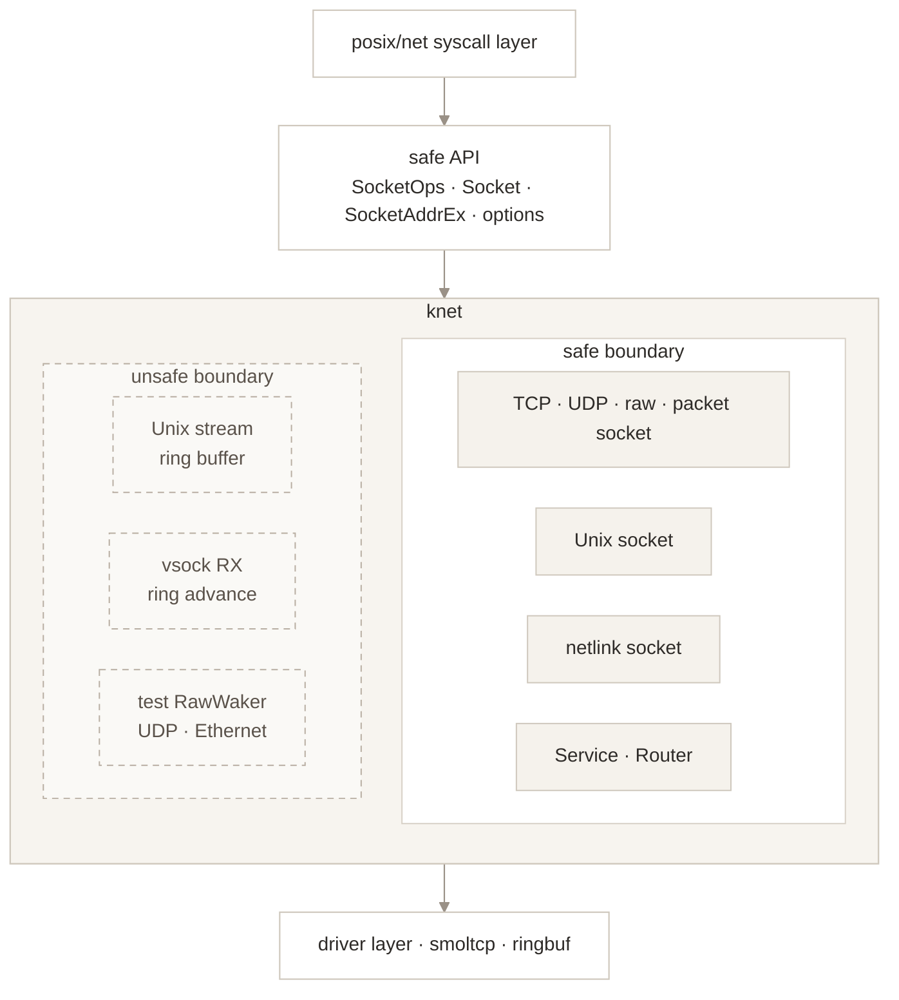

# knet — Safety and Reliability Analysis

## Analysis Scope

This analysis covers the entire `knet` crate: all source modules under `src/`,
including the `vsock` and `vsock_tipc_bridge` feature paths and `cfg(unittest)`
helpers. No in-crate module is excluded. The inventory describes explicit
unsafe sites in this crate; dependency internals and generated derive
implementations remain the responsibility of their providers.

The syscall layer supplies validated socket arguments and current-call
credentials. `kcred` defines credential predicates, `kvfs` enforces pathname
permissions, `kclass` and its device providers own network-buffer validity and
transport event contracts, and `ringbuf`, `smoltcp`, `zerocopy`, and `etherparse`
provide their respective buffer and parsing contracts. Driver DMA programming,
raw user-pointer access, host-side handshake clients, and TIPC service policy
are external responsibilities rather than guarantees established by `knet`.

## Trust Model



The trust relationships in the diagram define the security responsibilities of each layer. `knet` provides safe socket interfaces to upper layers and manages internal protocol state, routing state, and buffer boundaries. The syscall layer, filesystem, and driver layer are responsible for entry-point argument validation, access control, and underlying network resource management, respectively. Their responsibilities are defined as follows:

* `posix/net` handles syscall arguments, including user-pointer access, `sockaddr` length validation, and address-family parsing. `knet` receives validated arguments and maintains socket state, routing state, buffer boundaries, and the mapping from network errors to system error codes.

* For netlink mutations, `knet` checks permissions against the `Cred` snapshot passed by the entry point. The syscall and socket file layers provide this snapshot, which represents the current caller.

* Pathname Unix socket operations use the `Cred` snapshot supplied by the entry point for access control. kvfs handles path traversal, parent-directory modification permissions, and inode DAC checks.

* The driver layer supplies network data to `knet` through `NetBufHandle`, which guarantees that its data slices remain accessible throughout the handle's valid lifetime.

* In-crate parsing paths based on `zerocopy` and `etherparse` validate lengths and field boundaries for Ethernet, ARP, IPv4, and UDP packets. TCP, raw IP, and IPv6 packets continue to use smoltcp protocol parsing and validation.

* `Router` forms the network control-plane boundary. It converts external configuration into crate-defined address, CIDR, and neighbor entries before passing them to the device layer, which processes only network configuration prepared through this interface.

* Implementations that access raw memory or manipulate low-level buffers are confined to encapsulated unsafe boundaries. Public interfaces remain safe Rust APIs.

## Protected Assets

| Asset | Protection requirement and local evidence |
|-------|-------------------------------------------|
| Per-call `Cred` and its effective UID | `NetlinkSocket::send_with_cred` calls `Cred::is_privileged()`, which tests effective UID 0 in `kcred`. Mutations must use this call's identity, never the socket's open credential. Credential-free sends have no mutation authority. |
| Pathname socket inode and binding identity | `lookup_bind_entry` in [src/unix.rs](../src/unix.rs) checks final-inode `MAY_WRITE` through kvfs, verifies `NodeType::Socket`, and uses `path_bind_matches` to compare the upgraded inode with the resolved inode through `Arc::ptr_eq`. A stale or missing binding returns `ConnectionRefused`. |
| Filesystem ownership fields | Path lookup and creation pass the same `Cred` to kvfs. kvfs uses `fsuid`, `fsgid`, supplementary groups, inode owner/group, and mode bits for DAC and ownership initialization. User bind supplies `0777 & !umask`; `bind_with_cred` receives an explicit mode from its kernel caller. |
| Driver RX/TX memory and `PacketBuf` data | `EthernetDevice::poll_rx` finishes `handle_rx_frame` before `recycle_rx`; the provider owns buffer validity. `PacketBuf` owns packet storage and validates offsets and ranges through its accessors. Reference-counted handles keep storage alive across queues. |
| Unix stream and vsock ring-buffer storage | The unsafe inventory specifies the occupied/vacant range and lock prerequisites for slice access and index advancement. Publication must be limited to initialized bytes; consumption must remain within occupied bytes. |
| smoltcp `SocketHandle` values | `SOCKET_SET` owns handles under its mutex, and TCP deferred-close processing retains protocol state until closure permits reclamation. |
| Interface configuration and device identity | `NetDevice` owns link and neighbor state; Router owns addresses and routes. `network_config_lock` protects individual control-plane mutations and device removal. UDP matching uses `PacketBuf::ifindex` and `GeneralOptions::bound_dev_if` to preserve device selection. |
| TIPC channels, message handles, and client UUIDs | `VsockBridge::read_tipc_msg` rejects attached handles. `accept_reverse_tipc` checks the UUID returned by `ipc_port_accept` against `TipcToVsockMapping::allowed_uuids`, with an empty list explicitly permitting all UUIDs. |
| Queued AF_PACKET frame storage | `PacketFrame` retains an `Arc<[u8]>`; `PacketRxQueue::push_back` counts the full retained frame allocation and caps each queue at 64 KiB and 1024 frames. `recv_lock` serializes consumption while payload copies run outside `rx_queue`. |

## External Inputs and Trust Boundaries

`knet` receives network packets, control-plane messages, device buffers, and data from upper-layer syscalls.
This security analysis covers input validation, state updates, resource consumption, lifecycle management, and `unsafe` operations within the crate.

External inputs fall into the following categories:

- **Network packets**: Ethernet frames, ARP, IPv4, IPv6, TCP, UDP, ICMP errors, and raw IP packets; AF_PACKET also exposes frames with other EtherTypes.
- **Device events and buffers**: driver-provided `NetBufHandle` objects, IRQ wakeups, and RX/TX buffer allocation and recycling.
- **Control-plane requests**: caller credentials attached to each send, batches of netlink messages with their headers and attributes, route mutations, and neighbor updates.
- **Unix socket and vsock inputs**: peer data, connection establishment and closure events, user-specified listen backlog limits, and paths and inodes resolved by kvfs for pathname Unix sockets.
- **Syscall arguments and permission results**: socket address families, options, blocking semantics, and permission-check results supplied by `posix/net`.
  `posix/net` performs checks equivalent to `CAP_NET_ADMIN` for write ioctls such as
  `SIOCSIFADDR`, `SIOCSIFNETMASK`, `SIOCSIFBRDADDR`, `SIOCADDRT`, and `SIOCDELRT`; the interface-address, flag, and route mutation helpers in `knet` rely on this prerequisite.

`posix/net` handles user-pointer access and length validation. The POSIX send or socket file write entry point obtains the current caller's credentials
and explicitly passes them to `NetlinkSocket`. The driver layer handles DMA programming, and `knet` uses driver-provided network buffers.
Buffer validity and recycling time therefore form part of this module's trust boundary.

The threat analysis focuses on the following issues:

- Conditions under which external packets trigger out-of-bounds access, panics, inconsistent state, or resource exhaustion.
- Whether link and neighbor mutations go through the device-state owner, address and route mutations go through Router, and device unregistration shares a configuration lock with rtnetlink mutations.
- Whether netlink mutations reuse stale credentials or partially commit when batches mix operation types or queue space is exhausted.
- Memory-safety risks in the lifecycle management of driver buffers, socket handles, and ring buffers.
- Races between IRQ handling and ordinary protocol processing, and their effects on processing latency.

### Input Entry Points and Validation

The following entries identify concrete handoffs visible in the crate. Socket
arguments are typed values at this boundary; pointer accessibility and ABI
length checks belong to the syscall or IO provider. Local parsing still treats
network bytes, peer payloads, and control-plane requests as untrusted.

| Entry and source | Direction, checks, and failure behavior |
|------------------|----------------------------------------|
| `SocketOps::send` / `recv`, `Socket::send_with_cred`, and `SocketFileOps::write` in [src/socket/mod.rs](../src/socket/mod.rs) and [src/socket/file.rs](../src/socket/file.rs) | Callers provide `Read`/`IoBuf` payloads, typed addresses, options, and, where applicable, credentials; receive paths write to caller-provided `Write` buffers. IO errors propagate through `KResult`. The netlink file-write branch obtains `kprocess::current_cred()` on each call. |
| `NetlinkSocket::send_inner` in [src/netlink/socket.rs](../src/netlink/socket.rs) | The caller's datagram is copied before parsing. The socket must be bound or returns `NotConnected`. A route destination with nonzero pid or groups returns `EOPNOTSUPP`; another address family returns `InvalidInput`. `split_route_requests` accepts complete headers and stops at a short or invalid tail. Mixed batches return `EOPNOTSUPP`; insufficient response space returns `ENOBUFS`. Mutation privilege is checked per request using the current send's privilege result. |
| `NlMsgHeader::read`, `parse_attrs`, and `parse_ip_by_family` in [src/netlink/wire.rs](../src/netlink/wire.rs) | Header length must lie between `NLMSG_HDR_LEN` and available bytes or parsing returns `None`. Attributes require a length of at least 4 within available bytes or return `EINVAL`; short trailing bytes and missing final alignment padding are tolerated. IPv4/IPv6 attributes require exactly 4/16 bytes; wrong lengths return `EINVAL`, and unsupported families return `EAFNOSUPPORT`. `handle_rtnetlink_request` rejects a missing `NLM_F_REQUEST` flag with `EINVAL`, returns `EOPNOTSUPP` for unsupported operations, and encodes request errors as `NLMSG_ERROR`. |
| `UnixDomainSocket::bind_with_cred`, `create_bind_location`, and `lookup_bind_entry` in [src/unix.rs](../src/unix.rs) | Callers supply pathname or abstract addresses and credentials. Path creation delegates traversal and parent permissions to kvfs and maps an existing inode to `AddrInUse`. Lookup checks final-inode `MAY_WRITE`, socket type, and binding identity before invoking the transport. DAC errors propagate, a non-socket inode returns `NotASocket`, and an absent or stale binding returns `ConnectionRefused`. Abstract addresses use the in-memory table without inode DAC. |
| `DgramTransport::send` / `recv` in [src/unix/dgram.rs](../src/unix/dgram.rs) | Caller bytes, ancillary objects, and sender address enter a peer channel; explicit destinations pass through `lookup_bind_entry` with current credentials. Missing connections return `NotConnected`, failed channel sends return `BrokenPipe`, and empty receive queues return `WouldBlock`. Receive transfers ancillary objects and copies payload into the caller's writer. Channels are currently unbounded. |
| `ListenerQueue::reserve` in [src/unix/stream/listener.rs](../src/unix/stream/listener.rs) | Connect requests consume listener capacity before ring allocation. The configured capacity is `backlog.saturating_add(1).clamp(1, LISTEN_QUEUE_SIZE)`. A stopped listener returns `ConnectionRefused`; a full queue returns `WouldBlock` for nonblocking or expired waits. Interrupted waits propagate the interruption error. |
| `EthernetDevice::poll_rx` / `handle_rx_frame` in [src/device/ethernet.rs](../src/device/ethernet.rs) | The `kclass` network device supplies `NetBufHandle`. `EthernetFrameRef::new_checked` requires a complete 14-byte header. `ArpIpv4Packet::parse` requires a complete 28-byte Ethernet/IPv4 ARP header with hardware/protocol types 1/0x0800 and address lengths 6/4. Invalid frames or ARP records are dropped. RX data is copied into owned packet storage before recycling; provider buffer validity is trusted. |
| `Ipv4Header::validate_input_packet` / `parse_icmp_quote` in [src/stack/ipv4.rs](../src/stack/ipv4.rs) | Incoming network bytes must contain a valid IPv4 header; total length must cover the header and fit the packet, and checksum must match. Failures return `Ipv4Error::Malformed` or `BadChecksum`; accepted input is trimmed to total length. ICMP quotes permit a truncated original payload but still require a complete, checksum-valid header. |
| UDP binding to port zero and automatic binding on the first connect or send | Each ephemeral port allocation requires a ready kernel `entropy` pool and uses fresh ChaCha20 output. If entropy is unavailable, allocation returns `EAGAIN` before registering the PCB or publishing the local endpoint. Allocation continues to fail while the entropy source remains unavailable. Platforms must provide a trusted entropy source, and the `entropy` module is responsible for entropy collection, seed quality, and readiness. Port randomization makes off-path guessing more costly; applications remain responsible for source validation and authentication. |
| `prepare_ipv4_packet` in [src/transport/udp/input.rs](../src/transport/udp/input.rs) | The incoming IPv4 packet's UDP length must be at least 8 and fit the IP payload; `has_valid_udp_checksum` accepts zero checksums for IPv4 or validates the supplied checksum. Failure returns the original packet in `Err` for caller disposal. `deliver_ipv4_packet` applies local/peer/interface lookup; no match returns `NoSocket` with the retained packet. |
| `PacketSocket::bind` / `send` in [src/link/packet.rs](../src/link/packet.rs) | Bind accepts interface 0 as a wildcard or requires an existing interface, otherwise `ENODEV`. Send requires a positive interface index; an explicit invalid index returns `ENXIO`, an unspecified unbound destination returns `NotConnected`, and another address family returns `EAFNOSUPPORT`. `send_with_link` checks initialization and device existence, returning `ENODEV`; `validate_link_state_for_send` returns `ENETDOWN` for a down link, `InvalidInput` for a short raw header, or `EMSGSIZE` above the MTU limit. Datagram construction requires at least six destination MAC bytes and a nonzero protocol. `validate_protocol` currently accepts all protocol values. |
| `send_link_frame` in [src/link/mod.rs](../src/link/mod.rs) | A kernel caller supplies an interface index and complete frame slice to `Service::send_link_frame`. The exported helper returns `OperationNotSupported` before service initialization; this differs from the AF_PACKET socket wrapper's `ENODEV`. Device/frame validation belongs to the called Service/device path. |
| `VsockConnectionManager::handle_raw_event` in [src/vsock/connection_manager.rs](../src/vsock/connection_manager.rs) | The device provider supplies a typed `VsockTransportEvent` and body slice. Source address and destination port select the connection. Receive copies `body[..length]` when available and otherwise uses the whole supplied body; `push_rx_data` bounds the copy by free ring capacity and drops excess bytes. This layer relies on the provider for wire validation and does not reject a reported length larger than the supplied body. Bridge events carry the number of bytes actually stored. |
| `VsockBridge::recv_exact_record`, `parse_service_name`, and `read_tipc_msg` in [src/vsock/bridge.rs](../src/vsock/bridge.rs) | Host records are capped at `IPC_CHAN_MAX_BUF_SIZE` or return `OutOfRange`. Service names permit one trailing newline, require valid UTF-8, and must be nonempty, shorter than `IPC_PORT_PATH_MAX`, and NUL-free; failures return `InvalidInput` and trigger `[1]` rejection plus closure. TIPC messages with handles return `Unsupported`, oversized messages return `OutOfRange`, and short reads return `Io`; forwarding errors close the connection. |
| `VsockBridge::accept_reverse_tipc` in [src/vsock/bridge.rs](../src/vsock/bridge.rs) | TIPC returns a channel and client UUID through `ipc_port_accept`. `uuid_allowed` accepts a listed UUID or any UUID if the list is empty. A mismatch closes the channel and returns `PermissionDenied` before creating a vsock connection. The current `TIPC_TO_VSOCK_MAP` uses an empty allowlist. |
| `publish_kobject_uevent` in [src/netlink/socket.rs](../src/netlink/socket.rs) | A kernel publisher supplies a group and byte payload; the function appends a sequence number and delivers only to matching subscribed groups. Receive queues enforce `NETLINK_RX_QUEUE_LIMIT`; overflow drops the event. Publisher identity and payload provenance are trusted kernel-caller responsibilities. |

### Authorization and Residual Trust

Netlink route mutations use `Cred::is_privileged()`, currently effective UID 0,
and return `NLMSG_ERROR` with `EPERM` for an unauthorized request. This is a
local identity predicate, not a complete capability model. The file's stored
open credential does not authorize subsequent netlink writes.

Pathname operations propagate kvfs permission errors, including
`KError::PermissionDenied` from generic DAC checks. kvfs owns traversal,
parent-directory permissions, and inode permission policy; `knet` additionally
checks socket type and binding identity. Abstract Unix addresses have no
filesystem permission boundary.

Reverse TIPC forwarding relies on the UUID returned by TIPC. The current empty
allowlist permits every client accepted by the published TIPC service; it does
not provide per-TA isolation. Host-to-TIPC service connections pass
`IpcUuid::default()` to `ipc_port_connect_async`, so TIPC service policy owns
acceptance of that identity. Neither a vsock address nor a netlink pid field is
used here as authenticated caller credentials.

## Unsafe Code Inventory

### 1. Writing to Vacant Regions of the Unix Stream Ring Buffer

Locations: `StreamTransport::send` in [src/unix/stream.rs](../src/unix/stream.rs), lines 256 and 260.

```rust
let mut count = src.read(unsafe { left.assume_init_mut() })?;
if count >= left.len() {
    count += src.read(unsafe { right.assume_init_mut() })?;
}
```

Invariants:

- `left` and `right` come from the same call to `HeapProd::vacant_slices_mut`.
- The two slices represent vacant regions writable by the current producer.
- The return value of `Read::read` determines the number of bytes initialized.
- While the channel lock is held, no other path can concurrently advance the same producer.

Safety rationale:

- `send` obtains `chan.tx` after acquiring `self.channel.lock()`.
- Only the number of bytes returned by `Read::read` is published after writing.
- The `ringbuf` producer maintains the ring-buffer boundaries.

Caller:

- `StreamTransport::send`, called by `SocketOps::send` on a Unix stream socket.

### 2. Advancing the Unix Stream Write Index

Location: `StreamTransport::send` in [src/unix/stream.rs](../src/unix/stream.rs), line 275.

```rust
unsafe { chan.tx.advance_write_index(count) };
```

Invariants:

- `count` equals the total number of bytes written to `left` and `right` in this operation.
- `count` does not exceed the total capacity exposed by this call to `vacant_slices_mut`.
- The corresponding bytes are initialized before the write index advances.

Safety rationale:

- `count` is calculated solely by adding the two return values of `Read::read`.
- Each `Read::read` destination slice is bounded by the vacant region of the ring buffer.
- The channel lock protects the producer.

Caller:

- `StreamTransport::send`.

### 3. Advancing the Unix Stream Read Index

Location: `StreamTransport::recv` in [src/unix/stream.rs](../src/unix/stream.rs), line 312.

```rust
unsafe { chan.rx.advance_read_index(count) };
```

Invariants:

- `count` equals the number of bytes copied from the occupied regions returned by `chan.rx.as_slices` in this operation.
- `count` does not exceed the current readable length.
- The current implementation advances the index after copying and does not branch on `RecvFlags::PEEK`; it therefore consumes data even for a PEEK request. This is a receive-semantics limitation, not a safety precondition.

Safety rationale:

- `recv` accesses `chan.rx` after acquiring `self.channel.lock()`.
- The input slices passed to `dst.write` come from the occupied regions returned by `as_slices`.
- `count` is the sum of the two return values of `dst.write`.

Caller:

- `StreamTransport::recv`.

### 4. Advancing the vsock Receive-Buffer Read Index

Location: `Connection::advance_rx_read` in [src/vsock/connection_manager.rs](../src/vsock/connection_manager.rs), lines 187–189.

```rust
unsafe {
    self.rx_consumer.advance_read_index(count);
}
```

Invariants:

- The caller holds the connection lock.
- `count` comes from copying the same connection's `rx_slices`.
- `count` does not exceed the amount of data currently written to the receive buffer.

Safety rationale:

- `VsockStreamTransport::recv` reads `rx_slices` and calls `advance_rx_read` while holding `conn.lock()`.
- PEEK requests in `VsockStreamTransport::recv` preserve the current read index.
- `recv_bridge` holds `conn.lock()` while copying from `rx_slices` and calling `advance_rx_read`. Each copy is bounded by the remaining destination capacity and the source slice length, and `count` is the total number of bytes copied.
- The ringbuf consumer advances only while the connection lock is held.

Callers:

- `VsockStreamTransport::recv` when the `vsock` feature is enabled.
- `recv_bridge` in [src/vsock/connection_manager.rs](../src/vsock/connection_manager.rs) when the `vsock_tipc_bridge` feature is enabled.

### 5. Test-Only UDP `RawWaker`

Locations: the `tests` module in [src/transport/udp/wait.rs](../src/transport/udp/wait.rs):
`waker_clone` at line 109, `waker_wake` at lines 113–118,
`waker_wake_by_ref` at lines 121–124, `waker_drop` at line 132,
and `make_waker` at lines 135–141.

This `cfg(unittest)` implementation counts `PollSet` wakeups. `new_counter`
uses `Box::leak` to create a static `AtomicUsize`, and `make_waker` installs
that pointer with `WAKER_VTABLE`. The two wake callbacks cast the data pointer
back to `AtomicUsize` and increment it atomically. Clone preserves the same
pointer and vtable without reference-count updates, and drop does not free
the intentionally leaked allocation. `Waker::from_raw` relies on these
callbacks preserving the raw-waker data contract. These are the premises
stated in the local `SAFETY:` comments and the clone/drop safety contracts.

The wake callbacks have local `SAFETY:` comments for their dereferences but
lack separate function-level `# Safety` sections. Their unsafe-function
contracts remain a source-documentation follow-up; this inventory does not
certify that rustdoc coverage.

### 6. Test-Only Ethernet `RawWaker`

Locations: the `tests` module in [src/device/ethernet.rs](../src/device/ethernet.rs):
`waker_clone` at line 857, `waker_wake` at lines 861–864,
`waker_wake_by_ref` at lines 867–870, `waker_drop` at line 873,
and `make_waker` at lines 882–886.

This `cfg(unittest)` implementation tests RX-source wakeups. `new_counter`
leaks a properly aligned `AtomicUsize`; `make_waker` installs its static pointer
and `WAKER_VTABLE`. The local `SAFETY:` comments require the leaked, aligned
pointer for both dereferences and atomic increments on that allocation for
`Waker::from_raw`. Clone preserves the pointer and vtable; drop is a no-op.
The allocation remains valid for every callback, including callbacks after
cloning. The four unsafe callbacks lack function-level `# Safety` sections;
their standalone contracts remain to be documented in the source. The block
premises above are traceable to the existing local comments and constructors.

### 7. Other Explicit Unsafe Boundaries

The current crate sources contain no explicit `unsafe impl`, unsafe trait,
FFI declaration or definition, inline `asm!`, `global_asm!`, or standalone
assembly source. The thread-safety table below describes ordinary Rust types
and their synchronization, not handwritten unsafe trait implementations.
Test callback raw pointers are covered by entries 5 and 6; socket IO uses
`Read`, `Write`, and slice interfaces rather than public raw-pointer inputs.

## Memory Safety Invariants

### 1. `SocketHandle` Lifetime

Every smoltcp socket handle must still exist in `SOCKET_SET` when accessed.

### 2. `SocketSet` Mutual Exclusion

All reads and writes to `SocketSet` must acquire the `SOCKET_SET.inner` mutex.

### 3. `Service` Mutual Exclusion

Draining device receive queues, accessing routing state and inbound queues, and dispatching transmissions must acquire the internal Router mutex. The smoltcp Interface must be protected by a separate mutex.
IPv4 validation and snooping run outside the Router lock.

### 4. Ring-Buffer Publication Rules

Unix stream and vsock may publish only bytes that have been written and consume only bytes within the currently occupied region.
For Unix streams, the same directional lock orders write-index publication, directional closure, and EOF checks on an empty queue.

### 5. Driver Buffer Lifetime

`NetBufHandle::data` is used only before the handle is recycled. Receive handles must be returned after processing.

### 6. netlink Message Boundaries

All payload reads must follow validation of the individual message's header length, batch alignment boundaries, attribute lengths, and address family.
Batch splitting stops when fewer than a header's worth of bytes remain or when `nlmsg_len` is invalid or indicates truncation. Already processed messages remain effective, and trailing padding may contain nonzero values.

### 7. netlink Credential Boundary

Credential-bearing `Socket::send_with_cred` calls and netlink socket file writes use a snapshot of the current caller. `NetlinkSocket::send_with_cred` evaluates `Cred::is_privileged()` for that invocation. The credential-free `SocketOps::send` path passes `false` and cannot authorize mutations; read-only requests remain available.

### 8. netlink Batch Execution Boundary

A per-socket send-transaction lock serializes capacity prechecks, mutation execution, and response enqueueing.
`network_config_lock` serializes individual mutations across sockets, legacy socket ioctl mutations, and `unregister_netdev`. Each rtnetlink mutation acquires it separately; an entire batch is not isolated from other control-plane callers.
Batches mixing queries and mutations must be rejected before any state update.
Before executing a mutation-only batch, response-queue space must be checked for the entire batch.
A mutation-only batch is processed message by message. A later validation or operation error does not roll back earlier successful mutations. Capacity preflight reserves room for mutation responses on that socket, but does not provide all-or-nothing transaction semantics.
Responses are generated outside the receive-queue lock. The fixed lock order is send-transaction lock, `network_config_lock`, Router, ingress processing, Interface, and netlink receive queue, skipping locks that are not involved.

### 9. Route Index Boundary

After converting an rtnetlink route's `oif` into a device index, `dev < devices.len()` must be checked.

### 10. Static Object Initialization Order

`init_network` must initialize `SERVICE`, `SOCKET_SET`, and `LISTEN_TABLE` before any socket is created.

### 11. Credential Consistency for Pathname Operations

Lookup, creation, and owner initialization within a single Unix pathname bind must use the same `Cred` snapshot.

### 12. Credential Requirements for Kernel Callers

Kernel callers without a current user task must not enter implicit `current_cred()` paths.
Both pathname operations and socket file construction must select credentials explicitly.

### 13. `PacketBuf` Ownership

A pointer-sized reference-counted handle is created when a packet enters the network stack. Devices, Router, loopback, PCB, and smoltcp adapters transfer this handle by value.
Modifications after sharing use copy-on-write. Protocol offsets and validated UDP payload ranges must remain within the currently valid data range.

### 14. IPv4 Input Boundary

Before local delivery, the version, header length, total length, and header checksum must be validated, and trailing data must be trimmed according to `total_len`.

### 15. Network Type Boundary

`RouteTable` and `NetDevice` do not expose smoltcp address or time types.
`Router`, `Service`, and initialization entry points perform control-plane and protocol compatibility conversions.

### 16. IPv4 Reassembly Boundary

Fragments are isolated by source address, destination address, identification, protocol, and interface.
Fragments fully covered by an existing range are discarded as duplicates. Partial overlap or conflicting ranges cause the entire queue to be deleted.
Reassembly state is limited to 64 queues, a 4 MiB high watermark, a 3 MiB low watermark, and a 30-second timeout. Queue creation registers a fixed expiration event, which is canceled on completion, deletion due to an error, or capacity eviction. An expired queue that retains the first fragment generates ICMPv4 Time Exceeded.

### 17. UDP Receive Boundary

The parser validates UDP length, checksum, and payload boundaries. Each PCB receive queue holds at most 1024 datagrams.
PCB creation reserves pointer-sized `PreparedUdpPacket` slots for this limit.
The loopback send path must parse the datagram before disabling BH and store the result in the control metadata of the existing `PacketBuf`.
The `NetRx`/`SpinNoIrq` enqueue path may only move existing handles; allocation and capacity growth are prohibited.
When the queue is full, the PCB queue lock must be released before the current datagram is discarded.
`MSG_PEEK` may only increment the `PacketBuf` reference count under the lock; payload copying must occur outside `SpinNoIrq`.

### 18. IPv4 Output Boundary

The output MTU for in-stack UDP comes from the device selected by the matching route.
UDP and raw IPv4 return `ENETUNREACH` when no route exists or the output device is administratively down, and return `EMSGSIZE` when a DF packet exceeds the MTU. Payloads of packets that permit fragmentation are split only at 8-byte-aligned boundaries.

### 19. Poller Completion Conditions

The sole executor publishes `IDLE` or `SCHEDULED` from `RUNNING` or `RUNNING_PENDING` with a single CAS.
It may enter `IDLE` only when RX, ingress processing, TX, and expired timers have no immediately processable work and no notification arrived during execution.
Each processing round has a soft time limit of 1 ms. The kwork poller callback executes bounded batches of at most four rounds. If the limit is reached while immediately processable work remains, it retains `SCHEDULED` and queues the next batch.

### 20. Protocol Timer Conditions

After each round of `poll_maintenance`, `poll_ingress_single`, and `poll_egress`, `poll_at` must refresh the next deadline.
IPv4 reassembly queues publish their earliest deadline through a separate atomic source.
`has_immediate_timer_work` and `update_poll_timeout` must reread monotonic time at the end of the round and check absolute deadlines. Timers that have not expired must not contribute to `PollProgress::has_more`; expiration must publish work through `notify(PollReason::Timer)`.

### 21. TX and Receive-Window Handoff Conditions

Sockets and Router must publish newly generated TX work through `notify(PollReason::Tx)`.
After TCP consumes data from a receive buffer whose free space is below the maximum window-scaling quantum, it must publish zero-window recovery work through `notify(PollReason::RxWindow)`.
An actual increase in Router's data transmit-queue capacity must set `tx_capacity_changed`. Global capacity wakeups for TX waiters must depend solely on this field.

### 22. TCP Close Lifecycle

After the user file object is released, smoltcp handles with pending data, FIN, or retransmission state must remain in `SOCKET_SET`.
If the receive queue contains unread data, the aborted connection's handle must be retained until RST is sent.
A handle may be removed only after the protocol enters `Closed`.
The 60-second reclamation deadline applies only to `FIN_WAIT_2` handles detached from user file objects.

### 23. Network Timer Conditions

Protocol timers and deferred-close processing share an atomic deadline source. IPv4 reassembly uses a separate atomic source for its deadline and pending state.
The periodic sampling callback may only perform atomic state transitions, wakeups, and poller notifications. It must not acquire sleeping mutexes, allocate futures, or access the timer wheel.
Expired IPv4 queues are consumed in batches according to `PollBudget::timer_events`.

### 24. Link Configuration Ownership

`NetDevice` owns the interface name, MTU, administrative state, and link snapshot.
`RTM_NEWLINK` must validate name uniqueness, name format, device MTU range, and supported flags as a complete set before modifying the device.
Derived state bits in `ifi_change` are preserved according to Linux `IFF_VOLATILE` semantics. Actual changes to unsupported writable bits return `EOPNOTSUPP`.

### 25. IPv4 Address Lifecycle

After an address or its device is removed, Router address entries, automatic routes, IngressProcessor, the smoltcp Interface, and device projections must be refreshed while holding the Router lock once.
Legacy ioctl updates target only the primary address entry and preserve other addresses on the same device. Netmask updates must preserve address scope and custom broadcast addresses.
When the last instance of an address value disappears, configured routes in Router that depend on that `prefsrc` must be removed at the same time.
Device removal must also delete the device's routes and neighbors and renumber subsequent interface indices.

### 26. Poller Handoff Under Lock Contention

While holding global execution ownership, the poller may acquire Router, IngressProcessor, the smoltcp Interface, and socket-set locks only through `try_lock`.
Handing off an admitted-packet batch must acquire socket-set before Router. A batch containing only control packets skips socket-set.
Contention must return `has_more`.
If an expired IPv4 reassembly event encounters IngressProcessor contention, it retains its pending state and allows TX and protocol processing to continue for the current round.
The expiration path does not acquire this lock when no reassembly queue exists or no queue has expired.
Raw-packet batches already taken from devices, admitted-packet batches awaiting smoltcp, and control-packet batches awaiting transmission must retain ownership until handoff succeeds. TCP listener preparation and enqueueing of the admitted-packet batch must occur within the same successful handoff.

### 27. Loopback UDP Delivery Boundary

Before disabling BH, the loopback send path must write validated metadata for complete IPv4 UDP packets. Under `local_bh_disable`, it then places the same `PacketBuf` into `pending_udp` in the shared `NET_RX_QUEUE` and triggers `NetRx`.
`NetRx` dequeues only UDP packets with validated metadata from `pending_udp` and does not look up `LoopbackDevice`.
Both `NetRx` and supplemental processing in task context must use `SpinNoIrq` for UDP PCB lookup and enqueueing.
Delivery of complete IPv4 UDP packets is independent of the poller's `RUNNING` execution ownership.
`poll_rx` passes TCP, ICMP, IPv6, fragments, and UDP packets without a matching socket from `deferred` to the task poller.

### 28. `NET_RX_QUEUE` Capacity and Ownership Boundary

`pending_udp` and `deferred` must be preallocated according to `SOCKET_BUFFER_SIZE` when the device is created. `enqueue` checks capacity against the combined number of queued and in-flight packets and rejects excess packets, so `push_back` must never trigger capacity growth within `SpinNoIrq` or the `NetRx` softirq.
UDP packets with validated metadata taken by `process_pending` must count toward the in-flight reservation. Each batch is limited to `NET_RX_BUDGET` and delivered outside the lock.
Packets without a matching PCB must retain exclusive handle ownership, have their metadata cleared, and enter `deferred`.
When the queue is full, `enqueue` must return the packet to the caller. The send path then drops it after releasing the `NET_RX_QUEUE` lock and BH guard.
`discard_ifindex` must first move matching packets to a local container and drop them after unlocking to avoid heap deallocation within `SpinNoIrq`.
Supplemental processing in the send path's task context handles only the `pending_udp` packets present at entry, split into a fixed number of rounds according to `NET_RX_BUDGET`.
The queue identifies packet owners by `ifindex`, and `LoopbackDevice::drop` must call `discard_ifindex`.
For in-flight packets while `process_pending` has released the lock, this operation provides only best-effort cleanup. Complete device-identity semantics require registration state equivalent to Linux `skb->dev` and `NETREG_UNREGISTERING`.

### 29. TCP Listener Progress Conditions

When a TCP packet arrives or the SYN queue still contains child connections, the next actual network poll must refresh the corresponding listener.
`accept_poll` is awakened only after a child connection enters the accept queue, and the wakeup occurs outside the entry lock.
A nonempty SYN queue does not set `PollProgress::has_more`. Unexpired protocol timers continue to wait for expiration notifications, preventing half-open connections from causing poller busy loops.

### 30. Unix Listener Resource Boundary

The sum of pending requests and capacity reservations must not exceed `LISTEN_QUEUE_SIZE`.
The two 64 KiB ring buffers for each connection may be allocated only after capacity has been reserved successfully.
RAII must return the slot if reservation fails, the operation is interrupted, or the source socket's state rejects the connection.

## Thread Safety

| Type | Send Conditions | Sync Conditions |
|------|-----------------|-----------------|
| `TcpSocket` | All fields satisfy Send | Internal locks, atomics, and the global socket set serialize shared state |
| `PacketSocket` | All fields satisfy Send | `Arc<PacketSocketInner>` retains the socket; `local_addr` uses `RwLock`, `rx_queue` and `recv_lock` use `Mutex`, and statistics use atomics |
| `UdpSocket` | All fields satisfy Send | Locks and atomics in `Arc<UdpPcb>`, together with the bucketed PCB registry, protect shared state |
| `RawSocket` | All fields satisfy Send | `RwLock`, atomics, and immutable handles protect shared state |
| `StreamTransport` | All fields satisfy Send | `Mutex<Option<Channel>>` serializes local endpoint operations; the `ListenerState` mutex serializes the pending queue, capacity reservations, listening, and closure; a `SpinNoPreempt` lock for each send direction orders data publication, half-close, and EOF checks; three `PollSet` groups manage read, write, and connection-state waiters separately |
| `NetlinkSocket` | All fields satisfy Send | `Arc<NetlinkSocketInner>` internally uses `RwLock`, a send-transaction `Mutex`, a receive-queue `Mutex`, and `PollSet`; each send explicitly carries caller credentials, and the socket does not retain an authorization identity |
| `Service` | All fields satisfy Send | Separate internal `Mutex` instances protect Interface, Router, IngressProcessor, timeouts, and reusable batches; the poller acquires shared processing locks without blocking and retains batches during contention; network-timer and deferred-close deadlines are published atomically, and the periodic sampling callback never acquires sleeping mutexes |
| `Router` | Used within `Service` | Shared indirectly through the Router mutex in `Service` |

## Threat Analysis

| ID | Threat | Impact | Trigger | Consequence | Mitigation |
|----|--------|--------|---------|-------------|------------|
| T-01 | Incorrect initialization order causes `LazyInit` to access an uninitialized object | High | A socket is created or polled before `init_network` | Invalid initialization access can panic and prevent network service startup. | The boot path calls `init_network` from `core/kruntime` first; new entry points must preserve this order |
| T-02 | Access to a smoltcp socket handle after removal | High | Listener closure, accepted-child cleanup, and concurrent socket operations interleave | Access to a removed protocol object violates handle lifetime and can panic during socket operations. | A mutex serializes `SocketSet` access; `ListenTable::unlisten` drains the queue before removing handles; call sites must avoid caching handles and using them across release points |
| T-03 | Ring-buffer indices advance beyond the amount actually written or read | High | The count passed to `advance_write_index` or `advance_read_index` does not correspond to the source slices | Publishing unwritten bytes or consuming beyond occupied storage violates ring-buffer memory safety. | The count is computed from the same batch of slices obtained while holding the channel mutex; unsafe comments explicitly document these invariants |
| T-04 | Malicious netlink messages cause out-of-bounds reads or construct invalid state | High | Users supply short headers, malformed attributes, invalid address families, or invalid ifindex values | Malformed control-plane input can read outside message bounds or corrupt network configuration. | `NlMsgHeader::read`, `parse_attrs`, `parse_ip_by_family`, and route index checks reject invalid input |
| T-05 | ARP spoofing poisons the neighbor cache | Medium | An external host sends forged ARP replies or requests | Poisoned neighbor entries can redirect or disrupt traffic to affected peers. | Current checks cover unicast MAC addresses, broadcast, and local target IP addresses; comprehensive neighbor security still depends on network isolation |
| T-06 | A SYN flood fills the listen backlog | Medium | Many connection requests target the same listener | Legitimate connection requests are dropped, making the listener unavailable. | The listen backlog is capped at `LISTEN_QUEUE_SIZE`; excess requests are dropped with warning logs |
| T-07 | An unauthorized caller creates a raw socket | Medium | The syscall layer omits permission checks | An unauthorized process gains raw packet transmission or reception access. | `knet` only encapsulates raw socket behavior; permission policy should remain in `posix/net::sys_socket` |
| T-08 | uevents or responses fill the netlink receive queue | Medium | Subscribers do not consume messages while publishers keep writing | Subscribers lose uevents or request responses once queue capacity is exhausted. | `NETLINK_RX_QUEUE_LIMIT` bounds queue bytes per socket; excess messages are dropped |
| T-09 | Control-plane and data-plane state diverge | Medium | Link mutations fail to update device-owned state; rtnetlink and legacy socket ioctl address mutations interleave; device removal leaves stale address projections or control-plane routes; configured routes retain invalid `prefsrc` references after address deletion; or route and neighbor mutations bypass their state owners | Packets use stale devices, source addresses, or routes, causing misrouting or configuration inconsistency. | `network_config_lock` serializes updates across entry points and `unregister_netdev`; link queries and mutations directly access the `NetDevice` state owner; address and route queries and mutations directly access Router; interface-address queries complete under a single Router lock acquisition; `RTM_NEWNEIGH` directly accesses the target device; address and device deletion refresh automatic routes, ingress processing, Interface, and device projections; deleting the last instance of an address value or deleting a device also cleans up Router routes and updates interface indices |
| T-10 | External network packets trigger parser panics | Medium | Malformed Ethernet, ARP, IP, UDP, or TCP packets enter RX | A parser panic interrupts kernel network processing and can make service unavailable. | Ethernet and ARP use bounds-checked `zerocopy` views; IPv4 and UDP use in-crate bounds-checked parsers; TCP, raw IP, and IPv6 use smoltcp bounds-checked parsers; malformed packets are dropped |
| T-11 | Interrupt-context misuse causes lock contention or increased latency | Medium | An IRQ wakeup callback directly advances `SERVICE` or `SOCKET_SET`, or performs blocking socket operations | Blocking or contended work delays interrupt processing and can deadlock network IO. | The VirtIO interrupt handler only acknowledges interrupts and schedules the NetRx softirq; Ethernet NetRx marks or wakes receive event sources, while loopback NetRx delivers prepared UDP handles through the bounded non-sleeping PCB path; remaining work is queued for `knet-poller`; the kwork callback executes bounded batches of at most four rounds in ordinary task context |
| T-12 | Driver buffers or DMA input violate packet boundaries | High | A driver returns an invalid length, data is accessed after recycling, or TX/RX buffer lifetimes are mismanaged | Stale buffer references or invalid lengths can expose dangling data or violate memory safety. | RX data is parsed and copied only before `NetBufHandle` recycling; external frames use bounds-checked parsers; driver handles manage TX buffers |
| T-13 | The vsock-TIPC bridge incorrectly routes ordinary AF_VSOCK connections to TIPC | Medium | Event routing fails to distinguish bridge ports or already bridged connections | Ordinary socket traffic reaches the wrong IPC service or is consumed by the bridge. | The bridge takes ownership only of static port mappings and connection IDs it manages; unmatched events continue to `VSOCK_CONN_MANAGER` |
| T-14 | The host injects oversized or invalid TIPC messages through the bridge | Medium | A `Received` record exceeds TIPC slot capacity or the port 0 service name is invalid | Oversized or malformed records disrupt bridge connections and pressure message-buffer resources. | The bridge limits record length to `IPC_CHAN_MAX_BUF_SIZE`; dynamic service names must pass UTF-8, NUL, and length checks; invalid names receive `[1]` and the connection is closed |
| T-15 | TIPC handle/memref capabilities leak to the host through vsock | High | A TA sends a message with attached handles to the bridge | Capabilities intended for local TIPC participants cross the host trust boundary. | Bridge v1 forwards only bytes and closes the connection when it detects attached handles |
| T-16 | The host misinterprets the port 0 handshake result | Medium | The host sends payload before reading the status byte, ignores `[1]`, or blocks indefinitely without a recv timeout | The host sends data to an unestablished channel or waits indefinitely for a rejected service. | The protocol requires the host to read a one-byte status first: `0` means success and `1` means rejection; `libtrusty` uses `SO_RCVTIMEO`; CA tests reject any status other than `[0]` |
| T-17 | IPv4 fragments exhaust kernel memory | Medium | External sources continuously send distinct fragment streams that cannot be fully reassembled | Incomplete reassembly consumes memory needed by other kernel networking operations. | The reassembler limits queue count and total memory; exceeding the high watermark evicts the oldest queues until the low watermark is reached; queue lifetime is fixed at 30 seconds |
| T-18 | Overlapping IPv4 fragments confuse upper-layer parsing | Medium | Overlapping payload ranges are submitted under the same reassembly key | Ambiguous reassembly can change the payload interpreted by the receiving protocol. | Fragments fully covered by an existing range are dropped as duplicates; any partial overlap or conflicting total length deletes the entire queue |
| T-19 | A UDP receive flood fills socket queues | Medium | The application reads more slowly than packets arrive | Unread datagrams retain socket memory and cause subsequent packet drops. | Each PCB retains at most 1024 datagrams; pointer-sized queue slots are reserved at creation; new datagrams are dropped outside the lock when the limit is reached; the PCB directly reuses the `PacketBuf` handle created when the packet entered the network stack |
| T-20 | Pathname Unix sockets bypass inode/directory DAC or reuse existing inodes | High | bind/connect/sendto access the binding table directly, or bind accepts an existing path | A caller accesses a protected socket endpoint or attaches to the wrong inode binding. | bind uses `parent_at` and `Path::mknod` for exclusive creation; connect/sendto check `MAY_WRITE` on the final inode after lookup; only abstract addresses directly access the in-memory binding table |
| T-21 | A kernel task implicitly reads user credentials | High | Boot-time pathname bind calls ordinary `SocketOps::bind` before a current user thread exists or with the wrong credential identity | A missing user context panics, or the operation uses an unintended authorization identity. | Kernel callers use `bind_with_cred` to pass explicitly selected credentials such as `initial_cred()`; ordinary entry points serve only the current user task |
| T-22 | A Unix stream publishes data after EOF | Medium | send, shutdown, and peer recv interleave without a common ordering point for closure state and the write index | A receiver observes EOF followed by newly published bytes, violating stream ordering. | Each send direction shares `tx_order`; send rechecks under the lock before publishing; recv rechecks queue emptiness and connection closure under the lock; Channel publishes closure state before release |
| T-23 | A netlink socket reuses stale credentials for unauthorized mutations | High | A socket continues using creation-time permissions after transfer between processes or a change in caller credentials | A caller changes protected network configuration using another identity's authority. | POSIX send and socket file write obtain the current `Cred` only in the netlink branch; `NetlinkSocket::send_with_cred` checks each mutation; unauthorized requests generate `NLMSG_ERROR` with `EPERM` |
| T-24 | A netlink batch commits only some mutations | High | A single send mixes queries and mutations, or the response queue runs out of space midway through the batch | The caller observes only part of its intended configuration update. | The send-transaction lock serializes mutation batches on the same socket; mutations remain per-message operations without rollback; the complete batch is classified first; mixed batches return syscall `EOPNOTSUPP`; mutation-only batches check space for all responses before execution; a truncated or invalid subsequent header only stops splitting and does not roll back processed messages |
| T-25 | New events are lost during poller execution | Medium | RX, TX, or timer notifications race with the completion CAS | Pending network work is stranded, causing stalls or connection timeouts. | `kwork::BudgetedPoller` publishes notifications received during execution as `RUNNING_PENDING`; after a failed completion CAS, it retries according to the observed state, and one successful CAS both releases execution ownership and publishes the next round |
| T-26 | smoltcp protocol timers lack a progress event | Medium | A TCP retransmission or keepalive deadline arrives without a device IRQ or socket call | TCP retransmission and keepalive work stalls until another unrelated event arrives. | Each Interface poll registers a timer through `poll_at`; the end of each round checks the absolute deadline against freshly read monotonic time; expiration calls `notify(PollReason::Timer)` and wakes socket waiters; future deadlines do not trigger immediate repolling |
| T-27 | Socket TX work lacks background processing | Medium | connect, send, receive-window updates, or close update only socket state | Queued transmission remains pending and applications encounter IO stalls or timeouts. | Paths that actually generate TX work call `notify(PollReason::Tx)`; TCP and raw sockets register smoltcp send wakers; increases in Router data transmit-queue capacity wake global TX waiters |
| T-28 | TCP file closure loses data already accepted for transmission | Medium | `write` copies data into the smoltcp buffer and asynchronously publishes TX work, but file Drop removes the handle before the poller processes it | Payload already accepted by write is discarded before protocol transmission completes. | Drop transfers handles with incomplete protocol closure to the deferred-close registry; the poller reclaims them after data transmission, FIN processing, and retransmission complete; the 60-second deadline only limits resource retention by `FIN_WAIT_2` handles detached from user file objects |
| T-29 | Concurrent socket waits block network-timer updates | Medium | Socket wait registration manually polls an asynchronous sleep object under the timeout-state mutex, and waiting for the timer-wheel lock blocks the poller | Blocked timer updates delay protocol work and socket wakeups. | Deadlines are published atomically; after expiration, the periodic sampling callback directly wakes waiters and notifies the poller without holding the timeout-state mutex or creating or polling timer futures |
| T-30 | TCP close follows the FIN path despite unread data, notifying the peer of an orderly shutdown and losing the RST semantics expected by Linux | Medium | File-object release omits the receive-queue check, and protocol close directly enters FIN_WAIT1 | The peer receives an orderly close despite unread data being discarded. | Drop checks the smoltcp receive queue; unread data triggers abort, and the handle is retained until RST dispatch completes |
| T-31 | TCP zero-window recovery lacks background processing | Medium | The application reads the TCP receive buffer while the advertised window is still encoded as zero, without publishing window-recovery work | The peer continues to observe a closed receive window, stalling transmission. | Reads call `notify(PollReason::RxWindow)` when receive-buffer free space is below the maximum window-scaling quantum; after that quantum is reached, RX and registered protocol timers drive further window growth |
| T-32 | New events are lost during poller execution | Medium | RX, TX, or timer notifications race with the completion CAS | Pending RX, TX, or timer work is stranded after the executor finishes. | NetRx softirq, TX, and timer notifications share the same `kwork::BudgetedPoller` state machine; work arriving during execution is published as `RUNNING_PENDING`; a failed completion CAS retries according to the observed state, and one successful CAS both releases execution ownership and publishes the next round |
| T-33 | A compound link update commits partially | Medium | Renaming succeeds before MTU or flag validation fails | The device is renamed while other requested configuration fields remain unchanged. | `Router::update_device_link` validates the target device, name format and uniqueness, and MTU range before writing; the rtnetlink entry point ignores `IFF_VOLATILE` changes and rejects actual changes to unsupported writable bits; device setters receive only validated values |
| T-34 | Shared mutexes held by ordinary tasks retain poller execution ownership for an extended period | Medium | After acquiring `RUNNING`, the poller waits for Router, IngressProcessor, Interface, or socket-set held by another socket or control-plane task | Other network work cannot progress while the sole poller waits for a shared lock. | Polling rounds use `try_lock` for these shared locks; contention preserves batches awaiting handoff, returns `has_more`, and schedules later rounds through the existing four-state machine; IPv4 reassembly attempts the IngressProcessor lock only when expired events are pending and continues TX after contention; assisted processing remains limited to one round and attempts only one CAS to acquire execution ownership |
| T-35 | Loopback UDP delivery depends on poller ownership | Medium | `sendto` only queues the packet for transmission, and a short `SO_RCVTIMEO` expires while poller execution ownership is occupied | A locally sent datagram misses the receive deadline and causes a user-visible timeout. | The loopback send path writes validated UDP metadata before disabling BH, enqueues the packet in `NET_RX_QUEUE`, and triggers `NetRx`; when BH is restored, complete IPv4 UDP packets enter the PCB; TCP/ICMP and UDP packets without a matching socket continue through the poller |
| T-36 | Pending Unix stream listener connections exhaust kernel memory | Medium | An attacker continuously connects while the server does not call `accept` | Queued connections retain ring buffers and exhaust memory available to the kernel. | The backlog is converted according to Linux counting rules and capped at `LISTEN_QUEUE_SIZE`; capacity is reserved before ring-buffer allocation; nonblocking connections return `EAGAIN`, while blocking connections wait for capacity according to `SO_SNDTIMEO` and return `EAGAIN` on timeout; shutdown and Drop wake waiters |
| T-37 | A UDP socket receives ICMP errors from another device | Medium | ICMP error lookup loses the ingress interface index and treats an unknown device as a wildcard | A device-bound socket reports an asynchronous error for traffic from another interface. | Ingress processing passes `PacketBuf::ifindex` to UDP PCB lookup; a device-bound PCB matches only the same interface index |

| T-38 | AF_PACKET receive traffic retains excessive frame storage | Medium | A packet socket consumes frames more slowly than they are published | The receive queue drops new frames and retains bounded socket memory | `PacketRxQueue::push_back` enforces both 64 KiB and 1024-frame limits and counts full frame allocations even for datagram views; `publish_frame` increments drop statistics on rejection. |
| T-39 | Reverse TIPC forwarding reaches a host endpoint without per-client isolation | Medium | A client connects to a published forwarding service whose `allowed_uuids` is empty | Any client accepted by that TIPC service can forward bytes to the configured host endpoint | `VsockBridge::accept_reverse_tipc` closes mismatched UUIDs with `PermissionDenied` when an allowlist is configured. The current empty list permits all accepted clients; isolation depends on TIPC service access policy or a deployment-specific allowlist. |
| T-40 | Ethernet trace logging exposes packet contents | Medium | Trace logging is enabled while sensitive frames are sent or received | Packet payloads become visible to readers of the kernel log | `EthernetDevice::send_frame` and `poll_rx` log frame bytes at trace level. Production log configuration and access control must restrict this exposure; payload redaction is not implemented at these sites. |
| T-41 | Unix datagram peers retain unbounded queued messages | Medium | A sender continues enqueueing while the peer does not receive | Heap use grows with unread payloads and ancillary objects, risking resource exhaustion | `DgramTransport` uses `async_channel::unbounded` in socket-pair creation and bind. There is currently no queue quota; deployments must bound producer traffic or add queue admission limits. This remains an unmitigated resource limit. |

Impact levels:

- High: undefined behavior, memory corruption, or privilege escalation.
- Medium: panics, service unavailability, or inconsistent data.
- Low: performance degradation, lost logs, or reduced functionality.

## Failure Mode and Effects Analysis

| ID | Failure Mode | Cause | Local Effect | System Effect | Severity | Mitigation |
|----|--------------|-------|--------------|---------------|----------|------------|
| F-01 | No network device | `kclass::net_devices()` returns no devices | Only loopback is available | External TCP, UDP, and raw IP operations report no route or connection failure | 3 | `init_network` logs a warning; `Service::get_source_address` returns `ENETUNREACH` |
| F-02 | No route to the destination | `RouteTable::lookup` finds no match | The current send fails | Application connection failure | 3 | connect or send returns `ENETUNREACH`; the dispatch path logs a warning and drops the packet |
| F-03 | Ethernet pending queue is full | ARP is unresolved and `pending_tx` reaches its limit | Subsequent IP packets are dropped | Packet loss when communicating with one or more destinations | 3 | Log a warning; future work should split queues by next hop to reduce head-of-line blocking |
| F-04 | Driver transmit-buffer allocation fails | The NIC driver returns an `alloc_tx_buf` error | The current frame is not sent | Reduced network throughput or connection timeout | 3 | Log a warning and return; the upper-layer poller can continue retrying |
| F-05 | UDP ICMP error-queue entries are lost | Missing PCB registry registration, an invalid ICMP quoted header, or a closed socket | Missing `SO_ERROR` or error-queue information | Applications cannot obtain asynchronous network errors | 4 | Initialize the PCB registry at socket creation, register the PCB at bind, and unregister it on Drop; parse ICMP quoted packets through an IPv4 header path that permits truncated payloads |
| F-06 | A TCP connection awaiting acceptance is aborted | The peer resets during the handshake or the smoltcp child connection closes | `accept` returns `ConnectionAborted` | The application retries accept | 4 | `ListenTable::accept` removes closed child connections and continues scanning the queue |
| F-07 | A poll wakeup or protocol-timer event is lost | UDP socket notifications are lost; the TCP/raw device mask is incorrect; timeout or Ethernet RX event sources are not registered; the registration owner is released during `Pending`; readiness is not rechecked after registration; or timer expiration fails to notify the poller | Delayed blocking socket waits, TCP retransmissions, or keepalives | Higher application IO latency or connection timeout | 3 | UDP receive waiters are notified when packets are enqueued, errors occur, or the socket is shut down; changes to TCP/raw device bindings notify waiters to rebuild RX registrations and recheck the event version; `Service::register_rx_waker` uses the same `PollContext` to register timeout polling and Ethernet receive-poll event sources that support interrupt-driven reception; devices without `NetRxScheduler` fall back to the timeout aggregate waker; callers retain `PollRegistrations` and recheck readiness after registration; each Interface poll registers the deadline returned by `poll_at` and calls `notify(PollReason::Timer)` on expiration |
| F-08 | Malformed netlink request | Invalid header or attribute length | An empty response or netlink error is returned | The caller's request fails | 4 | Bounds-checked readers and error-response handling |
| F-09 | Network service or control plane is uninitialized | An AF_PACKET or netlink route request precedes `SERVICE` or Router initialization | AF_PACKET device binding and sending return `ENODEV`; link dumps are empty, mutations return errors, and address or route dumps are empty | The corresponding network functions are temporarily unavailable | 2 | Check initialization before every `SERVICE` query; initialize Router and `SERVICE` before public network interfaces become available; new boot paths must preserve this order |
| F-10 | A Unix stream peer closes early | The channel is shut down or released | send returns `BrokenPipe` if no progress was made, or a partial byte count otherwise; recv returns EOF after draining the local buffer; if the peer discards unread input on closure, recv returns `ConnectionReset` once; polling reports `RDHUP`, `HUP`, or `ERR` | The application observes connection closure | 4 | Endpoint atomics record both half-close states and pending resets; `tx_order` for each send direction orders closure and data together; three `PollSet` groups selectively wake waiters for affected events |
| F-11 | Heavy network processing runs in interrupt context | IRQ or `NetRx` incorrectly calls socket send, recv, or `poller::assist_once` | Lock contention, scheduling delays, or deadlock | Higher network IO latency or severe system stalls | 2 | IRQ paths only acknowledge device interrupts, mark RX pending, and schedule `NetRx`; Ethernet `NetRx` only wakes the device RX `PollSet`; loopback writes validated UDP metadata into the existing `PacketBuf` before disabling BH; `NetRx` takes only UDP packets with validated metadata from `NET_RX_QUEUE` and delivers them through allocation-free `SpinNoIrq` lookup and handle enqueueing without looking up `LoopbackDevice`; softirqs must not call `poller::assist_once` or acquire `Service` / `SocketSet` mutexes |
| F-12 | Incorrect RX buffer recycling order | Frame payload remains referenced after `recycle_rx` | Dangling-data reads or data corruption | Packet parsing errors or, in severe cases, memory-safety violations | 1 | `EthernetDevice::poll_rx` completes parsing and copying before recycling; new device adapters must preserve this lifetime |
| F-13 | Port 0 handshake waits indefinitely | The host connects before the TA publishes the service without setting a receive timeout, or the service is never published | Host `read` blocks; negative tests hang | The CA/test process becomes unresponsive | 3 | Dynamic connections retain `WAIT_FOR_PORT`; the host sets `TRUSTY_VSOCK_TIMEOUT_SEC`; explicit rejection returns `[1]` |
| F-14 | Rapid reconnect causes `tipc_connect` timeout `-11` | Bridge event routing discards a receive event before its connection-request event has created bridge state, losing the service-name record | Reading the status byte on the host returns `EAGAIN`; roughly half of rapid reconnects fail | Intermittent failures in storage clients and the proxy test framework | 2 | `VsockConnectionManager::handle_raw_event` recognizes reserved local ports and records `is_bridge` on the connection; `push_bridge_event` and `pop_bridge_event` preserve FIFO event order |
| F-15 | IPv4 fragment reassembly times out | Subsequent fragments are missing 30 seconds after the first fragment arrives | The current datagram is lost | UDP receive timeout | 3 | Delete expired queues; send ICMPv4 Fragment Reassembly Timeout when the first fragment is present and replies are permitted |
| F-16 | A UDP DF datagram exceeds the route MTU | `IP_MTU_DISCOVER` requires DF and packet length exceeds the route MTU | The current send fails | The application receives `EMSGSIZE` | 4 | Read the route MTU before sending; Router rejects output fragmentation of DF packets |
| F-17 | Boot-time Unix pathname bind panics | A kernel task calls implicit `current_cred()` before a current user thread exists | Kernel sockets such as `/dev/log` cannot bind | Boot is interrupted | 2 | Use `bind_with_cred` with explicit `initial_cred()` during boot; retain a usable initial filesystem context |
| F-18 | An expired smoltcp poll deadline becomes an excessively long wait | A negative signed microsecond difference is converted through `as u64` | The software timer is set far into the future | TCP data-path stalls with a risk of accompanying timer IRQ anomalies | 2 | Map `SmoltcpInstant` directly to `MonotonicInstant` on the same time base without calculating an unsigned delay; unit tests cover expired and future deadlines |
| F-19 | Unauthorized netlink mutation request | The credentials for the current send lack configuration permission | The mutation is not executed; the receive queue gets `NLMSG_ERROR` with `EPERM` | The caller's configuration attempt fails | 4 | Recheck credentials on every send; after enqueueing the error response, the send entry point returns the consumed request length |
| F-20 | Mixed or truncated netlink batch | A single send mixes queries and mutations, or a subsequent message is too short or truncated | A mixed batch is not executed and returns a syscall error; a truncated tail only stops further parsing | The caller must correct or split the batch | 4 | Classify the batch before state updates or response generation; stop splitting when fewer than a header's worth of bytes remain or `nlmsg_len` is invalid |
| F-21 | RX or TX backlogs monopolize the processing task | A sustained packet rate exceeds the per-round budget | A round reaches its budget or 1 ms soft time limit with work still pending | Scheduling delays for other tasks or reduced network throughput | 3 | Device RX, stack ingress, stack egress, and Router TX check time after at most 32 work items; each batch runs at most four consecutive rounds, then reschedules and releases execution ownership, leaving remaining work for the next batch |
| F-22 | A TCP peer does not send FIN after the local file closes | The peer acknowledges the local FIN, but the protocol handle remains in `FIN_WAIT_2` after detachment from the user file object | The deferred-close registry keeps socket buffers alive | Network memory grows with unresponsive connections | 3 | Set a 60-second deadline on entry to `FIN_WAIT_2`, include it in the unified poll timer, and reclaim the handle on expiration |
| F-23 | The IPv4 output device is administratively down | `RTM_NEWLINK` clears `IFF_UP` on the device selected by the matching route | The current UDP or raw IP send fails | The application receives `ENETUNREACH` | 4 | UDP and raw IP validate the output route and device administrative state through `SERVICE` before committing the send buffer |
| F-24 | Data-plane shared-lock contention | A socket or control-plane task holds Router, IngressProcessor, Interface, or socket-set | The current polling round ends early and retains its batches | Network work is deferred to the next round | 3 | Return `has_more`; the sole executor publishes `SCHEDULED` through the completion CAS; raw, admitted, and control-packet batches retain ownership and resume from their saved positions in the next round |
| F-25 | Short-timeout loopback UDP loses packets while the poller is busy | `sendto` only notifies the poller, and the 1-jiffy `recvfrom` timeout expires first | Concurrent libc-test `socket.exe` runs intermittently report `ETIMEDOUT` | A user-visible functional regression | 3 | `NetRx` delivers loopback UDP to the PCB within the send path's BH window; the poller no longer performs this delivery; stress tests cover four concurrent short-timeout operations with SMP=1 and SMP=4 |
| F-26 | A TCP child connection remains in the SYN queue indefinitely | The packet marker is consumed before the child becomes acceptable, and later ingress processing or timer polling does not refresh the listener | The accept queue stays empty | The server remains blocked in `accept` after connection establishment | 2 | Refresh listeners with nonempty SYN queues after each actual network poll; wake waiters only after a child enters the accept queue; SYN queues do not request continuous polling |
| F-27 | Connect or accept waits indefinitely after Unix listener shutdown | A listener state change does not notify capacity and request events | Blocking `connect` or `accept` cannot return | Application threads remain asleep indefinitely | 2 | Both `shutdown(SHUT_RD)` and Drop notify `capacity_available` and `request_available`; queued requests are delivered first, and blocking `accept` on an empty queue returns `EINVAL`; blocking `connect` with `SO_SNDTIMEO` returns `EAGAIN` when its capacity wait times out |

Severity levels:

- 1: Fatal; system crash or data loss.
- 2: Severe; functionality is unavailable and recovery requires a restart.
- 3: Moderate; functionality is degraded and can recover automatically.
- 4: Minor; impact is limited and acceptable to users.

## Failure Management

- Ordinary input errors are returned through `KError` and `LinuxError`, such as `EINVAL`, `EAFNOSUPPORT`, `ENETUNREACH`, `EADDRINUSE`, and `EWOULDBLOCK`.
- netlink batch splitting stops when fewer than a header's worth of bytes remain, or when `nlmsg_len` is smaller than the header or larger than the remaining bytes. Already processed messages are not rolled back, and trailing padding may contain nonzero values. Payload or attribute errors detected after batch splitting return `NLMSG_ERROR`.
- Unauthorized netlink mutations return `NLMSG_ERROR` with `EPERM` through the receive queue. Batches mixing queries and mutations return syscall `EOPNOTSUPP` before any state mutation.
- Malformed packets are rejected by the RX parsers and their callers. Logging depends on the path: malformed ARP uses a debug log, while some parser failures return `None` or an error without a dedicated log. Trace logging records Ethernet frame bytes before protocol parsing.
- Full UDP PCB receive queues and Router TX queues result in packet drops or `WouldBlock`; the poller waits for IO readiness events.
- Full smoltcp buffers and Unix stream ring buffers return `WouldBlock`, and the poller waits for IO readiness events. A nonblocking Unix stream send returns a partial byte count if it has already made progress. When a Unix listener backlog is full, nonblocking `connect` returns `WouldBlock`; blocking connections wait according to `SO_SNDTIMEO` for `accept` to release capacity or for the backlog limit to increase, and return `WouldBlock` on timeout.
- Full loopback and Ethernet queues drop packets and log warnings. When the shared `NetRx` queue is full, loopback send still returns success, matching Linux `loopback_xmit`, which returns `NETDEV_TX_OK` even when `__netif_rx` returns `NET_RX_DROP`.
- Panic paths include initialization order, violated internal invariants, `expect` assertions, and the driver RX recycling `unwrap` in `EthernetDevice::poll_rx`. New public entry points should validate inputs and return errors through `KError` before entering paths that contain internal assertions.

## Privacy Analysis

`knet` handles data sent by user processes through sockets, network packet payloads, Unix socket credentials, netlink messages, and vsock payloads.
These data reside in kernel socket buffers, ring buffers, driver buffers, or netlink queues. The module itself stores them only in memory.
Ordinary logs omit payload contents, while trace logs record Ethernet frame bytes. Production environments must control log levels to limit exposure of sensitive network data.

## Known Limitations

- `StreamTransport::recv` currently consumes copied bytes even when `RecvFlags::PEEK` is requested. `DgramTransport::recv` also dequeues before copying. Callers must not rely on non-consuming Unix socket PEEK semantics until those paths implement them.
- netlink mutation-only batches have response-capacity preflight and per-socket serialization, but later operation failures do not roll back earlier mutations. `network_config_lock` is acquired per mutation, so different callers can interleave between messages in a batch.
- Unix datagram channels are unbounded. The stream listener limit and AF_PACKET/netlink queue limits do not bound their queued payloads or ancillary objects.
- `NetlinkSocket::send_inner` and `PacketSocket::send` copy the caller's full input into a `Vec` before later protocol checks. Receive-queue quotas do not cap these transient send allocations; upstream request-size and workload limits remain relevant.
- The reverse TIPC forwarding map currently has an empty UUID allowlist, accepting every client admitted by the TIPC service. Per-client isolation requires a nonempty mapping or external service policy.
- `VsockConnectionManager::handle_raw_event` trusts the provider's typed events and copies only available receive bytes. A receive length larger than the supplied body is not rejected, and a full connection ring drops excess bytes. Record completeness depends on the provider and flow-control contract.
- The unsafe callback functions identified in the test-only inventory have incomplete function-level safety documentation. Existing local block comments are recorded above; missing callback contracts remain a source follow-up.
- Driver RX recycling is assumed to succeed: `EthernetDevice::poll_rx` calls `recycle_rx(...).unwrap()`. A provider recycling error can panic despite successful packet parsing.

- `RTM_GETNEIGH` neighbor dumps remain unimplemented. `RTM_NEWNEIGH` mutations delegate neighbor updates to the device-state owner.
- IPv4 output uses the MTU of the device selected by the matching route. The next-hop MTU in ICMP Fragmentation Needed enters only the UDP error queue; a dynamic PMTU cache is not yet implemented.
- IPv4 output fragmentation supports only packets generated within the stack without IP options. IP option copying semantics are not yet implemented.
- Route dumps read configured routes and address-derived routes from Router.
- smoltcp maintenance and each egress operation have bounded work, while ingress advances packet by packet through `poll_ingress_single`. Protocol processing for one packet or a single egress operation can still briefly exceed the soft time limit.
- Nonblocking retry on Router, IngressProcessor, Interface, and socket-set contention preserves the poller ownership boundary. Short critical sections within transports, the listen table, and device callbacks can still briefly exceed the soft time limit.
- Each UDP receive queue reserves 1024 pointer-sized slots at PCB creation, so idle sockets still incur this fixed metadata overhead.
- Address and route dumps read Router directly; link dumps read live device snapshots directly.
- The syscall layer controls raw socket creation permissions; `knet` constructors themselves take no process-credential argument.
- Ethernet devices handle only IPv4 ARP. IPv6 NDP, non-Ethernet links, and multiqueue NIC abstractions remain to be extended.
- The in-crate UDP data path currently supports only IPv4. The smoltcp DNS path continues to use IPv6 UDP, while ordinary UDP sockets do not support IPv6 transmission or reception.
- The vsock-TIPC v1 bridge does not forward TIPC handles or memrefs and does not maintain a persistent retry queue for vsock transmit credits.
- `SO_BINDTODEVICE` setsockopt currently performs no privilege check. Linux 6.8 requires `CAP_NET_RAW` only if the socket is already bound to a device, covering both rebinding and unbinding; the first bind is unchecked. x-kernel approximates capability permissions with euid 0 and has not yet implemented this rebinding check.

## Verification References

These are existing verification points, not results of a test run performed
for this document update. Test names are resolved against current source.

| Documented control | Existing verification |
|--------------------|-----------------------|
| Current-send netlink authorization | [src/netlink/tests.rs](../src/netlink/tests.rs): `test_route_mutation_checks_each_send_credential` checks unprivileged `EPERM`, an unprivileged query, and a privileged request on the same socket. |
| Batch classification and response-space preflight | [src/netlink/tests.rs](../src/netlink/tests.rs): `test_route_socket_rejects_mixed_query_and_mutation_batch` checks rejection before mutation; `test_mutation_queue_reservation_failure_preserves_network_state` checks `ENOBUFS` and unchanged address state. Neither test establishes rollback of later operation failures. |
| netlink length and trailing-byte handling | [src/netlink/tests.rs](../src/netlink/tests.rs): `test_malformed_nlmsg_len_does_not_mutate_network_state`, `test_route_dump_ignores_nonzero_short_trailer`, and `test_route_dump_stops_at_invalid_trailing_header`. |
| Compound link updates | [src/netlink/tests.rs](../src/netlink/tests.rs): `test_reject_invalid_link_name_and_mtu_without_partial_update` checks invalid configuration without partially updating device state. |
| AF_PACKET memory accounting | [src/link/packet.rs](../src/link/packet.rs): `test_datagram_empty_payload_frames_are_accounted` exercises the frame-count limit for empty datagrams; `test_queue_drop_statistics` checks oversized-frame rejection and drop accounting. |
| AF_PACKET transmission rejection | [src/link/packet.rs](../src/link/packet.rs): `test_send_ifindex_errors` and `test_send_link_state_validation` check interface, link-state, short-header, and MTU failures. |
| AF_PACKET receive ownership | [src/link/packet.rs](../src/link/packet.rs): `test_peek_preserves_frame` and `test_recv_write_failure_preserves_packet` check retention across PEEK and failed destination writes. These tests do not cover Unix stream PEEK. |
| IPv4 overlap and duplicate handling | [src/stack/fragment.rs](../src/stack/fragment.rs): `test_ipv4_reassembly_drops_overlapping_fragments` and `test_ipv4_reassembly_keeps_queue_on_duplicate_fragment`. |
| Reassembly deadlines and bounded expiration | [src/stack/fragment.rs](../src/stack/fragment.rs): `test_ipv4_reassembly_deadline_is_fixed_at_queue_creation` and `test_ipv4_reassembly_expiration_respects_timer_budget`. |
| Unix address lookup and lock handoff | [src/unix.rs](../src/unix.rs): `unix_missing_abstract_address_returns_connection_refused` and `unix_abstract_lookup_releases_registry_before_callback`. Pathname DAC remains a kvfs contract and is not established by these abstract-address tests. |
| UDP and Ethernet test waker use | [src/transport/udp/wait.rs](../src/transport/udp/wait.rs): `test_udp_socket_waiters_wake_all_read_waiters`; [src/device/ethernet.rs](../src/device/ethernet.rs): `test_net_rx_softirq_wakes_only_pending_sources`. They exercise callback use, not a complete proof of raw-waker soundness. |
| TIPC UUID policy, record length, and handle rejection | Inspect `uuid_allowed`, `accept_reverse_tipc`, `recv_exact_record`, and `read_tipc_msg` in [src/vsock/bridge.rs](../src/vsock/bridge.rs), together with `TIPC_TO_VSOCK_MAP` in [src/vsock/bridge_port_map.rs](../src/vsock/bridge_port_map.rs). The empty allowlist and error branches are directly reproducible source checks. |
| Trace payload exposure | Inspect the `trace!` calls in `EthernetDevice::send_frame` and `poll_rx` in [src/device/ethernet.rs](../src/device/ethernet.rs) and the deployment's enabled log level. |

To run crate unit tests, prepare `.config` from a platform defconfig and use
`make unittest UNITTEST_CRATE=knet` according to the repository
[build workflow](../../../docs/ai/skills/build-workflow/SKILL.md). Feature-specific
coverage requires enabling `vsock` and `vsock_tipc_bridge` through the relevant
Kconfig configuration; ordinary builds do not exercise those paths or test-only
callbacks automatically.

## Audit Checklist

Changes to this module must verify the following:

- Every `unsafe` block has a `SAFETY:` comment.
- The lifecycle of each new smoltcp socket handle is protected by `SOCKET_SET`.
- New link and neighbor mutations directly update state owned by the target device.
  Address and route mutations update Router and refresh derived projections under `network_config_lock`.
  Deleting the last instance of an address value also removes configured Router routes that depend on that `prefsrc`.
  Device removal uses `unregister_netdev` to delete and renumber routes and device neighbors under the same lock.
- Every credential-bearing netlink send or socket file write receives the current caller's `Cred` snapshot; sockets do not cache permissions. Credential-free sends remain unprivileged.
- New netlink parsers validate individual message header lengths and batch alignment boundaries before validating attributes, address families, and indices.
- Send transactions on the same netlink socket remain serialized. `network_config_lock` serializes mutations across control-plane entry points.
  Device removal uses `unregister_netdev`.
  The lock order is send-transaction lock, `network_config_lock`, control-plane state-owner locks, and receive queue.
- Query-only and mutation-only batches support per-message processing. Mixed batches return `EOPNOTSUPP` before state updates, and mutation batches check space for all responses before execution.
- Index advancement in new ring-buffer operations is derived from the same batch of slices under the same lock.
- Unix stream write-index publication, directional closure, and empty-queue EOF checks retain a common ordering point for each send direction. User copies and `PollSet` wakeups occur outside directional locks, and shutdown wakes waiters after releasing the `channel` mutex.
- Unix listener changes keep the sum of pending requests and capacity reservations within `LISTEN_QUEUE_SIZE`. Ring buffers are allocated after capacity reservation; binding-slot and state locks are released before blocking waits; shutdown and Drop wake connect and accept waiters.
- Unix pathname filesystem-context locks and abstract-address binding-table locks are released before transport callbacks. Blocking connect does not hold address-lookup-layer locks.
- New external network inputs use bounds-checked parsers.
- IPv4 fragment reassembly changes preserve queue-count, memory, and timeout limits and reject overlapping ranges.
- `SO_BINDTODEVICE` updates `GeneralOptions::bound_dev_if` through atomic exchange. UDP receive filtering, UDP transmission, and TCP/raw RX device selection read the same field. Relaxed reads carry only the interface index. When the value changes, the `PollEvent` version publishes the update with Release/Acquire ordering and wakes device RX waiters. RX registration retains the subscription to configuration events and rechecks the event version to detect changes between device selection and registration completion. Binding and unbinding rebuild device RX registrations; default and unbound states select all devices. Notifications trigger readiness rechecks, and actual IO state determines user-visible events. Protocol receive filtering enforces packet isolation.
- UDP waits for reception alone subscribe only to the socket's read, error, and shutdown events. Packet enqueueing, asynchronous errors, and read shutdown publish their state before notifying waiters. Readiness checks after registration account for notifications that arrived earlier, and cancellation removes all subscriptions. Ingress filters packets using the current `bound_dev_if`, so existing receive subscriptions remain valid when the binding changes. Ethernet RX, loopback sends, and timers independently advance network processing. Waits for reception alone are independent of device RX broadcasts and global protocol timer broadcasts. Waits that include write events retain the network progress notifications required for TX.
- UDP registry changes keep bind, connect, ordinary receive, and ICMP error lookup tied to the same PCB ownership source. Ordinary receive and ICMP error lookup use their respective incoming packet's interface index for `SO_BINDTODEVICE` filtering. Buckets, connected-peer state, and PCB receive queues shared by `NetRx` and tasks must use `SpinNoIrq`; state updates that can sleep must remain outside these locks.
- Changes to the poller state machine or `Service::poll_budgeted` verify the four-state transitions, sole-executor acquisition, release through a single CAS, staged smoltcp budgets, and the 1 ms soft time limit.
  `PollProgress::has_more` includes only immediately processable work. Protocol timers reread monotonic time at the end of each round and check absolute deadlines; expired IPv4 queues are consumed in batches according to the timer budget.
  Only `tx_capacity_changed` triggers global capacity wakeups for TX waiters.
- Changes to locking in `Service::poll_budgeted` preserve `try_lock` semantics for shared processing locks and set `has_more` on contention.
  Only pending IPv4 expiration events participate in lock-contention retries, and TX processing continues after contention. Raw, admitted, and control-packet batches retain ownership before retrying.
  TCP listener preparation occurs only when the admitted-packet batch can immediately enter Router.
- TCP listener progress changes verify that entries with nonempty SYN queues are refreshed after actual network polling. Waiters are awakened outside the entry lock only after child connections enter the accept queue, and SYN queues remain excluded from `PollProgress::has_more`.
- Changes to poller execution boundaries verify that assisted processing attempts only one CAS and respects the single-round budget.
  Loopback UDP must reach the PCB within the send path's BH/`NetRx` window, independently of poller execution ownership.
- Changes to `NET_RX_QUEUE` verify that `pending_udp` and `deferred` are preallocated at device creation and that `enqueue` counts both queued and in-flight packets toward capacity.
  Capacity growth, heap deallocation, and UDP PCB delivery occur outside `SpinNoIrq` locks. Packets dropped because the queue is full or during `discard_ifindex` cleanup must also release `PacketBuf` outside the lock.
  `process_pending` batches are capped at `NET_RX_BUDGET`, and supplemental processing in the send path uses a fixed number of rounds.
  Unit tests sharing this queue must declare `serial`.
- UDP PCB queue changes verify that PCB creation reserves 1024 pointer-sized slots and that `PacketBuf` establishes its reference-counted lifetime when entering the network stack.
  Loopback must write validated UDP metadata before disabling BH; softirq and `SpinNoIrq` enqueue paths only move existing handles.
  Receive queues preserve FIFO order, full queues drop packets outside the lock, and `MSG_PEEK` also copies payloads outside the lock.
- Changes to TCP Drop or asynchronous TX verify that successfully written payloads remain owned by the protocol object after file closure, unread data at close triggers RST, deferred-close handles are removed after `Closed`, and the reclamation deadline applies only to `FIN_WAIT_2` handles detached from user file objects.
- New socket options specify error codes, blocking semantics, and poll readiness conditions.
- New pathname Unix socket entry points use a single credential snapshot and pass it explicitly to all VFS operations.
- Pathname binding preserves exclusive creation, uses mode `0777 & !umask`, and takes ownership information from filesystem credentials.
  connect/sendto check `MAY_WRITE` on the final inode before reading the binding.
- New kernel call paths must not depend on `current_cred()`.
  Callers must select credentials explicitly.
- Before adding a public API, verify whether cross-crate exposure is required.
